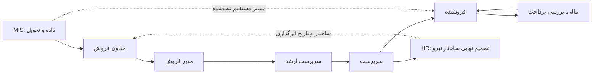
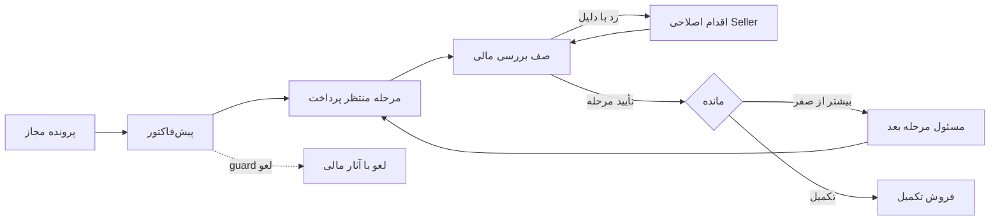

# CRM Product & Role Architecture Audit

تاریخ بررسی: ۳۰ سپتامبر ۲۰۲۶ — محیط مرجع محصول: https://crm.maximumclub.ir/ — نسخه قابل مشاهده افزونه: **2.0.123**.

این سند Audit معماری محصول، نقش‌ها، گردش کار، مجوزها و ساختار اطلاعات است. هیچ پیشنهاد این سند پیاده‌سازی نشده است. «SELLER DESIGN V1 FROZEN» بنیاد طراحی بصری باقی می‌ماند؛ ظاهر قدیمی Seller هدف طراحی نیست.

## Executive Summary

CRM قابلیت‌های اصلی فروش، توزیع داده، بررسی پرداخت، ساختار نیروی انسانی و گزارش‌گیری را دارد، اما قرارداد مشترکی برای «پرونده»، «لید»، «مالک»، «پیش‌فاکتور»، «پرداخت تأییدشده» و «قابل برگشت» در همه ماژول‌ها اعمال نمی‌شود. اولویت اصلاح محصول باید یکسان‌سازی این قراردادها و حفاظت گردش کار باشد؛ بازطراحی ناوبری به‌تنهایی اختلاف آمار و قفل عملیات را حل نمی‌کند.

مهم‌ترین یافته‌ها:

| ID | اولویت | نتیجه | شاهد / اطمینان |
|---|---|---|---|
| F01 | P0 | قفل فاکتور در برگشت MIS رابطه `invoices.lead_id = virtual_id` را بررسی می‌کند، درحالی‌که صدور V4 آن را صفر می‌کند و `distribution_items.follow_invoice_id` را می‌نویسد. پرونده نمونه با فاکتور متصل، زنده «قابل برگشت» بود. | BOTH / HIGH برای ناسازگاری؛ اجرای برگشت NOT VERIFIED |
| F02 | P1 | سرپرست ارشد و معاون یک فاکتور دارند ولی پیش‌فاکتور را صفر نشان می‌دهند؛ predicate شمارش `pre_invoice` را در مجموعه pending/draft/unpaid وارد نمی‌کند. | BOTH / HIGH |
| F03 | P1 | شمارش لید در برخی عملکردهای مدیریتی فقط `sn_leads` را می‌خواند؛ پرونده تحویل‌شده V4 در Seller و MIS دیده می‌شود ولی این شمارش صفر است. | BOTH / HIGH؛ یکسان‌بودن معنای مورد انتظار INFERENCE |
| F04 | P1 | آمار Supervisor و گزارش عملیاتی Manager فاکتور صفر دارند، ولی جدول فاکتورها و گزارش مشترک یک فاکتور دارند. علت نهایی کش، مسیر داده یا تفاوت Build اثبات نشده است. | LIVE VERIFIED / HIGH برای اختلاف؛ علت NEEDS VALIDATION |
| F05 | P1 | در Manager، بخش رفتار مشتری پس از چند مراجعه همچنان پیام بارگذاری هنگام بازشدن دارد و کنترل‌های واقعی دیده نشد؛ renderer مورد انتظار در کد وجود دارد. | LIVE VERIFIED / MEDIUM؛ علت NOT VERIFIED |
| F06 | P1 | `sn_view_finance` علاوه بر مشاهده، در guard ساخت قانون، بررسی اجرای پورسانت، تغییر کلید ارسال و ارسال کیف پول استفاده می‌شود. نام «view» قرارداد کم‌اختیار قابل اتکایی نیست. | CODE VERIFIED / HIGH؛ HR/Finance runtime NOT LIVE VERIFIED |
| F07 | P1 | renderer کیف پول مسیر قدیمی autopost را با force فراخوانی می‌کند؛ شرط matrix engine و داده واجد شرایط می‌تواند مانع آن شود. مشاهده صفحه از نظر کد لزوماً خالص نیست. | CODE VERIFIED / HIGH؛ وقوع ثبت در جلسه NOT VERIFIED |
| F08 | P1 | HR عملیات سمت، مدیر، مجوزهای کاربر، حقوق و رمز را در یک قلمرو وسیع مدیریت می‌کند؛ تغییرات ساده و حساس نیاز به قرارداد مجوز و بررسی متفاوت دارند. | CODE VERIFIED / HIGH برای دامنه؛ تفکیک پیشنهادی INFERENCE |
| F09 | P2 | گزارش‌های MIS زمان وقوع رویداد را برای انتخاب پرونده استفاده می‌کنند و وضعیت جاری هنگام گردآوری را نشان می‌دهند؛ نباید با snapshot تاریخی پایان بازه اشتباه شوند. | BOTH / HIGH |
| F10 | P2 | تکرار جدول عملکرد چهار سطح در Deputy، گزارش‌مرکزهای مشترک و عملیات قدیمی/جدید، هزینه ناوبری و نگهداری را بالا می‌برد. ادغام باید معنا و scope را حفظ کند. | BOTH / HIGH برای ساختار؛ تصمیم محصول INFERENCE |

**نتیجه پذیرش:** معماری هشت نقش و تصمیم‌های محصول در این سند تکمیل شده است. Live QA اقدامات تغییردهنده انجام نشده و بخشی از اعتبارسنجی آتی است؛ نبود حساب HR/Finance مانع تحلیل کد نبوده است.

## روش، Evidence و حدود اعتبار

- `LIVE VERIFIED`: همان صفحه، کنترل، داده یا رفتار خواندنی در حساب نقش مشاهده شد؛ به معنی اجرای موفق action نیست.
- `CODE VERIFIED`: شرط، query، handler یا renderer در ZIP بررسی شد؛ اجرای موفق روی سایت از آن استنتاج نشده است.
- `BOTH`: ادعای مشخص در مشاهده و کد هم‌جهت است؛ این برچسب به همه رفتارهای همان ماژول تعمیم نمی‌یابد.
- `INFERENCE`: مأموریت، تناوب استفاده، ارزش، معماری هدف و تصمیم پیشنهادی محصول. `NEEDS VALIDATION` تصمیم نگهداری تا بررسی شرط اعلام‌شده است.
- `NOT LIVE VERIFIED`: runtime نقش واقعی بررسی نشده است. برای HR و Finance در تمام این سند برقرار است؛ دسترسی Admin جایگزین آن نیست.
- `HIGH`: شاهد مستقیم/شرط روشن؛ `MEDIUM`: مشاهده محدود یا چند مسیر؛ `LOW`: فرضیه نیازمند داده کسب‌وکار. خالی‌بودن جدول، شاهد بی‌ارزش‌بودن قابلیت نیست.

مأموریت‌ها و Daily/Occasional Jobs برداشت محصول از قابلیت‌های موجودند، نه نتیجه مصاحبه یا سنجش فراوانی استفاده. تناوب‌های جدول‌ها پیشنهادی‌اند. ستون «اقدام» مالکیت قابلیت را توصیف می‌کند، نه اقدام انجام‌شده در Audit. تصمیم‌های KEEP/REMOVE/MERGE/MOVE/SIMPLIFY/RENAME/ADD همگی پیشنهاد هستند.

در جلسه هیچ فرم تغییر کاربر/مجوز/مشتری/فاکتور، پرداخت، ارسال SMS/لینک، Assignment، Import یا ذخیره تنظیمات عمداً اجرا نشد. ناوبری، impersonation موجود و گزارش خواندنی استفاده شد. کد خود سیستم در برخی read paths migration، گزارش موقت و autopost دارد؛ بدون snapshot دیتابیس قبل/بعد ادعای «هیچ write داخلی رخ نداده» نمی‌شود. گزارش MIS از job موقت استفاده می‌کند؛ این با تغییر رکورد کسب‌وکار یکی نیست، ولی برای Audit کاملاً بدون write باید مسیر query خالص فراهم شود.

ZIP بررسی‌شده: `sales-network-v4-2.0.123-phase1-ux-mis-report-tab.zip`؛ SHA256: `ae785ad4b27224e2ec015477188cf54409a251f3ad362f3a4d42181e39b03802`؛ ۲۵۸ entry. یکسانی شماره نسخه سایت و ZIP اثبات یکسانی byteهای نصب‌شده نیست. اختلاف‌های وابسته به Build در گزارش قطعی علت‌گذاری نشده‌اند.

شواهد خام در [evidence](../evidence/) و نقشه دسترسی پذیرفته‌شده در [ROLE ACCESS MAP](ROLE-ACCESS-MAP.fa.md) نگهداری شده‌اند. اسناد خام ممکن است داده محیط تست داشته باشند؛ گزارش حاضر شماره تماس و نام مشتری را بازنشر نمی‌کند. پرونده/فاکتور نمونه فقط با شناسه داخلی یا عنوان «نمونه ۱» ارجاع داده می‌شود.

## Current CRM Role Architecture / Role Hierarchy

| ترتیب | نقش واقعی بررسی‌شده | پنل | وضعیت مشاهده |
|---|---|---|---|
| 1 | Seller، کاربر 6 | `/seller-panel/` | Live مشاهده؛ mutation اجرا نشد |
| 2 | Supervisor، کاربر 5 | `/supervisor-panel/` | Live مشاهده؛ mutation اجرا نشد |
| 3 | Senior Supervisor، کاربر 4 | `/crm-senior-supervisor/` | Live مشاهده؛ mutation اجرا نشد |
| 4 | Sales Manager، کاربر 3 | `/sales-manager-panel/` | Live مشاهده؛ mutation اجرا نشد |
| 5 | Sales Deputy، کاربر 2 | `/crm-sales-deputy/` | Live مشاهده؛ mutation اجرا نشد |
| 6 | MIS، کاربر 7 | `/crm-mis/` | Live مشاهده؛ mutation اجرا نشد |
| 7 | HR | `/crm-hr/` | CODE VERIFIED / NOT LIVE VERIFIED؛ Admin فقط برای discovery |
| 8 | Finance | `/financial-approval/` | CODE VERIFIED / NOT LIVE VERIFIED |

زنجیره فعال نمونه: Deputy 2 ← Manager 3 ← Senior 4 ← Supervisor 5 ← Seller 6. MIS 7 در زنجیره فروش نیست. «سمت HR»، «سطح»، «WP role»، «user capability»، «مالک پرونده» و «پورسانت‌گیر» شش مفهوم جدا هستند. داشتن رابطه والد لزوماً همه اقدامات فرزند را مجاز نمی‌کند.

تحویل مستقیم MIS به Seller در نمونه ثبت شده است؛ این نمودار مسیر مطلوب واحد اجباری اعلام نمی‌کند. ساختار فعلی ۱۶ مسیر پنل و سمت‌های دیگری مانند converter، خدمات پس از فروش، ارسال و عملیات دارد؛ وابستگی آن‌ها در handoff ثبت می‌شود ولی Audit کامل آن نقش‌های خارج از هشت نقش، ادعا نمی‌شود. Scope mode در discovery خاموش بود؛ خاموش‌بودن آن معادل حذف همه owner checks قدیمی نیست.

## Role-by-Role Audit

### 1. Seller

**Role Mission:** تبدیل پرونده مجاز خود به نتیجه تماس و فروش قابل پیگیری، با حفظ مالک فروش و تاریخچه مالی. **Daily Jobs:** صف تماس، نتیجه تماس/زمان بعدی، صدور پیش‌فاکتور از پرونده، پیگیری واریز/رد مالی، اقدام تکراری. **Occasional Jobs:** درخواست شماره اضافه، تبدیل واگذارشده به خود، بررسی پورسانت، اصلاح اطلاعات لازم مشتری. Evidence مأموریت INFERENCE / HIGH؛ وجود قابلیت‌ها مطابق جدول زیر.

**Screen & Navigation Inventory / Feature Classification.** هفت تب در حساب نمونه دیده شد؛ `new-invoice` تب هشتم شرطی در کد است. مسیرهای داخل فرم و جدول نیز جدا طبقه‌بندی شده‌اند.

| Page/Tab یا بخش | هدف / تناوب پیشنهادی | اقدام اصلی؛ ثانویه | Data Needed | کلاس | تصمیم و دلیل | Evidence / Confidence |
|---|---|---|---|---|---|---|
| leads / شماره‌های من | انجام تماس؛ روزانه | نتیجه تماس؛ جستجو، فیلتر، اطلاعات مشتری، شروع فاکتور | پرونده V4 یا legacy، owner، تماس، source | ESSENTIAL | KEEP؛ صف کار اصلی با مرجع پرونده مشترک | BOTH / HIGH |
| KPI سربرگ | پایش کار خود؛ روزانه | مشاهده؛ ورود به لیست مرتبط | تعداد/بازه/مبنای شمارش | CONFUSING | SIMPLIFY؛ عدد بدون بازه و denominator مبهم است | LIVE VERIFIED / HIGH |
| صف بدون وضعیت/همه | یافتن کار جدید؛ روزانه | فیلتر؛ جستجو | وضعیت جاری و archive | CONFUSING | RENAME؛ صفر در صف بدون وضعیت با کل یک پرونده تناقض منطقی نیست | BOTH / HIGH |
| no_answer / callback / not_purchased | نتیجه تماس؛ روزانه | ثبت نتیجه/زمان/دلیل؛ تاریخچه | attempts، callback_at، reason، آخرین فعالیت | ESSENTIAL | KEEP؛ قواعد هر نتیجه باید مستقل از رنگ/label بماند | CODE VERIFIED / HIGH؛ ذخیره NOT VERIFIED |
| new-invoice مستقل | فروش دستی مجاز؛ موردی | صدور؛ انتخاب محصول/مشتری | global flag و effective override | SUPPORTING | KEEP به‌صورت شرطی؛ در حساب نمونه قابل مشاهده نبود | CODE VERIFIED / HIGH |
| فاکتور از پرونده | فروش منتسب؛ روزانه | صدور؛ مرحله پرداخت، آدرس محصول فیزیکی | source hardlink، owner، product type، قیمت | ESSENTIAL | KEEP؛ حذف به نفع صدور آزاد، انتساب را می‌شکند | CODE VERIFIED / HIGH |
| my-conversions | پرونده تبدیل واگذارشده به خود؛ موردی | پیگیری تبدیل؛ مشاهده مراحل | assignment شخصی، Dot case | SUPPORTING | KEEP شرطی؛ از صف فروش عادی جداست | BOTH / HIGH برای صفحه؛ نتیجه action NOT VERIFIED |
| repeat-actions | تکمیل پرداخت/اقدام مجدد؛ روزانه | ادامه stage؛ مشاهده مسئول بعدی | remaining، next actor، original seller | ESSENTIAL | RENAME به «اقدام بعدی من» با نوع اقدام؛ با ready-for-conversion یکی نیست | BOTH / HIGH |
| invoices | پیگیری فروش؛ روزانه | جزئیات/ثبت اطلاعات واریز؛ فیلتر | invoice/stage/payment/history | ESSENTIAL | KEEP؛ مرجع مالی فروشنده | BOTH / HIGH |
| رسید و پیش‌پرداخت | ارائه سند پرداخت؛ روزانه | ثبت رسید؛ اصلاح مبلغ قبل از قفل | stage فعلی، مبلغ due، receipt، guard | ESSENTIAL | SIMPLIFY؛ مرحله و ممنوعیت ویرایش پس از پرداخت روشن شود | BOTH / HIGH برای کنترل؛ ارسال NOT VERIFIED |
| resend / copy payment link | کمک به پرداخت؛ موردی | ارسال مجدد؛ کپی لینک | current payable، محدودیت ارسال | SUPPORTING | KEEP؛ ارسال و کپی دو action با پیامد متفاوت‌اند | LIVE VERIFIED / HIGH؛ ارسال انجام نشد |
| تاریخچه مالی | فهم رد/تأیید؛ روزانه | مشاهده؛ رجوع به اقدام بعدی | actor، زمان، reason، stage | ESSENTIAL | KEEP؛ حذف history برای خلوتی مجاز نیست | BOTH / HIGH |
| customer-actions | فهم رفتار مشتری؛ موردی | جستجو/مشاهده؛ رجوع به فاکتور | event، مشتری، invoice | SUPPORTING | MOVE به پروفایل مشترک مشتری، میانبر حفظ شود | BOTH / HIGH |
| extra-number-request | ورود شماره خارج صف؛ موردی | درخواست؛ پیگیری تصمیم | phone، optional name/note، manager | SUPPORTING | KEEP شرطی؛ تأیید مدیریت را دور نزند | BOTH / HIGH |
| wallet / فروش و پورسانت | فهم دریافتی؛ موردی | مشاهده؛ فیلتر روش پرداخت | ledger، matched rules، accrued vs settled | SUPPORTING | KEEP؛ محاسبه پیش‌نمایش و موجودی قطعی جدا شود | BOTH / HIGH |
| wallet / بیاوین | منبع درآمد دیگر؛ موردی | مشاهده | نوع کیف پول، تراکنش | SUPPORTING | NEEDS VALIDATION؛ صفر بودن نمونه دلیل حذف نیست؛ نیاز قرارداد تجاری | BOTH / MEDIUM |
| پروفایل، رمز من، خروج، حالت شب | کار با حساب؛ موردی | مدیریت شخصی/خروج | هویت و role context | SUPPORTING | KEEP؛ خروج از impersonation باید واضح باشد | LIVE VERIFIED / HIGH |
| SLA/صف موعدگذشته قابل اتکا | اولویت اقدام امروز | مشاهده/پیگیری | due date، owner، overdue reason | MISSING | ADD پس از اعتبارسنجی؛ callback موجود است ولی کارتابل SLA جامع اثبات نشد | INFERENCE / MEDIUM |

**Workflow Map:** دریافت پرونده → مشاهده/تکمیل اطلاعات → نتیجه تماس. no_answer شمارنده حداکثر سه تلاش؛ callback نیاز به زمان؛ not_purchased نیاز به دلیل؛ صدور فاکتور → انتظار پرداخت → رسید/پرداخت آنلاین → بررسی مالی → رد و اقدام مجدد، یا پرداخت جزئی و مرحله بعد، یا تکمیل. در کد archive عدم پاسخ بعد از سه تلاش و سه روز بی‌فعالیتی، عدم پرداخت assessment پس از سه روز و سایر انواع پس از پنج روز وجود دارد؛ archive حذف فاکتور/تعهد مالی نیست. Runtime این انتقال‌ها اجرا نشده است.

**Handoff Map:** MIS/زنجیره فروش → Seller (source + owner + زمان تحویل)؛ Seller → Finance (invoice + stage + receipt)؛ Finance → Seller (reason یا remaining + next action)؛ پرونده Dot → مسئول تبدیل واگذارشده؛ تکمیل فروش → Woo/عملیات/ارسال طبق نوع محصول. original seller و commission owner نباید با next actor تعویض شوند.

**Permission Analysis / Data Visibility:** guard پنل WP Seller یا HR position seller را قبول می‌کند. handler نتیجه تماس owner و archive را بررسی می‌کند. صدور دستی تابع global flag و override سطح فرد/سرپرست است؛ owner Seller در core به کاربر جاری محدود می‌شود. queryهای V4 و legacy مرجع متفاوت دارند؛ تست منفی cross-owner اجرا نشده است. قابلیت ارسال لینک، ثبت رسید و ویرایش پیش‌پرداخت باید در UI و handler یک policy مشترک داشته باشند. جزئیات guardها در ضمیمه کد.

**KPI Audit:** total=1، followed=1، preinvoice=1، approved revenue=0، successful payments=0 در نمونه. عدد «پیگیری‌شده» باید بر اساس event معتبر و «فروش» بر اساس پرداخت تکمیل‌شده تعریف شود؛ پیش‌فاکتور، پرداخت جزئی و درآمد تأییدشده یکی نیستند. نرخ تبدیل = پرونده یکتای واجد شرایط تکمیل‌شده / cohort پرونده تحویل‌شده، با بازه و attribution اعلام‌شده؛ پیشنهاد INFERENCE، اکنون denominator استاندارد در همه پنل‌ها اثبات نشده است.

**Report Audit / Redundancy:** جدول فاکتورها عملیات است، behavior timeline ابزار پشتیبان، wallet گزارش شخصی؛ این سه ادغام دیتایی دارند ولی هدف یکسان ندارند. پیشنهاد پروفایل مشترک با تب مالی/تعاملات، نه حذف timeline. **Missing Capabilities:** task overdue، توضیح قفل stage، ارتباط قابل مشاهده پرونده→فاکتور، اختلاف accrued/posted/settled؛ نیاز محصول باید تأیید شود. **Product Risks:** حفظ انتساب در repeat، statusهای legacy، اشتباه قیمت/مرحله، تماس تکراری. **Priorities:** P0 F01 وابستگی مالکیت؛ P1 قرارداد پرونده/پرداخت/مجوز؛ P2 ساختار صف و KPI؛ P3 binding دقیق visual prototype. **Confidence:** HIGH در موجودی، MEDIUM در گردش کار اجرایی مشاهده‌نشده.

**Binding به SELLER DESIGN V1 FROZEN:** صف‌های none/no_answer/callback/not_purchased/duplicate/invoiced/all و ماژول‌های فاکتور، تبدیل، کیف پول، رفتار، درخواست، repeat قابل استفاده‌اند. داده mock، toast و statusهای demo قرارداد runtime نیستند. باید adapter برای source_kind/source_id، attempts و callback، invoice/payment stage، financial reason، آدرس نوع محصول، override صدور دستی و original owner تعریف شود. تصمیم حفظ بنیاد بصری است؛ طرح جدید بصری پیشنهاد نمی‌شود.

### 2. Supervisor

**Role Mission:** مدیریت کار روزانه فروشندگان مستقیم، تحویل صحیح پرونده و رفع توقف فروش؛ نه تصاحب همه اقدامات Finance یا HR. **Daily Jobs:** آمار/صف تیم، توزیع شماره، پایش فاکتور و ready conversion. **Occasional Jobs:** بازگرداندن شماره واجد شرایط، اشتراک، درخواست HR، بررسی خطا/کیف پول. Mission/frequency INFERENCE / HIGH.

| Page/Tab یا بخش | هدف / تناوب | اقدام اصلی؛ ثانویه | Data Needed | کلاس | تصمیم و دلیل | Evidence / Confidence |
|---|---|---|---|---|---|---|
| sellers | فروشندگان و آمار؛ روزانه | بارگذاری آمار؛ فیلتر/جزئیات | direct sellers، source، interval | ESSENTIAL | KEEP؛ reconcile F04 قبل اعتماد مدیریتی | BOTH / HIGH |
| بارگذاری دستی آمار و هشدار 504 | کنترل دریافت سنگین؛ روزانه | refresh | زمان داده، error/retry | CONFUSING | SIMPLIFY؛ freshness و خطا جدا از داده صفر | LIVE VERIFIED / HIGH |
| converter-stats | عملکرد تبدیل؛ روزانه/هفتگی | مشاهده؛ drilldown | assigned converter، case، completion | SUPPORTING | KEEP؛ denominator مشخص شود | LIVE VERIFIED / HIGH برای صفرها |
| my-conversions | تبدیل‌های شخصی؛ موردی | کار روی assignment شخصی | own Dot assignments | SUPPORTING | KEEP شرطی؛ کار شخصی از مدیریت تیم جدا | BOTH / MEDIUM |
| assign / تخصیص شماره | تغذیه تیم؛ روزانه | تخصیص؛ case/count/note، برگشت | owned balance، direct seller، batch | ESSENTIAL | KEEP؛ dry-run و حفاظت فاکتور مشترک | BOTH / HIGH؛ apply NOT VERIFIED |
| needs-action / آماده‌های تبدیل | کنترل ready queue؛ روزانه | assignment به خود/تبدیل‌کننده | eligibility، owner، referral | ESSENTIAL | RENAME «آماده تخصیص تبدیل»؛ با repeat پرداخت تفاوت دارد | BOTH / HIGH برای ساختار |
| subscriptions | اصلاح اشتراک پیش از پرداخت؛ موردی | تغییر انتخاب؛ مشاهده | subscription، any payment lock | SUPPORTING | MOVE به جزئیات فروش/اشتراک؛ guard حفظ شود | BOTH / MEDIUM |
| distribution-logs | رفع خطای تحویل؛ موردی | مشاهده خلاصه عملیات | operation ID، failed rows/reason | SUPPORTING | MOVE به ابزار عملیات؛ جدول بلند قبلی حذف شده، summary حفظ | BOTH / HIGH |
| unassign زنده/قدیمی | آزادسازی legacy؛ موردی | انتخاب محدوده؛ تاریخ/status/import | sn_leads، seller، last N | SUPPORTING | MERGE ورودی کار با برگشت V4، اما backend semantics جدا | BOTH / HIGH |
| invoices | رفع توقف فروش تیم؛ روزانه | مشاهده/رسید؛ link/prepayment/history | scoped invoice، current stage | ESSENTIAL | KEEP؛ actionها برحسب مجوز | BOTH / HIGH |
| ارسال لینک انتخاب و عملیات مالی Seller | کمک عملیاتی؛ موردی | ارسال انتخاب/رسید؛ تاریخچه | product eligibility، scoped seller | SUPPORTING | NEEDS VALIDATION درباره delegating؛ Finance approval اضافه نشود | LIVE VERIFIED / HIGH برای کنترل‌ها |
| customer-actions | رفتار مشتری تیم؛ موردی | search؛ timeline | scoped customer events | SUPPORTING | MOVE به customer profile مشترک؛ loading باقی‌مانده اصلاح | LIVE VERIFIED / HIGH |
| hr-requests | انتقال/قطع همکاری؛ موردی | درخواست؛ دلیل، مقصد، مشاهده مسیر | seller درscope، reviewer chain | SUPPORTING | KEEP؛ final apply نزد HR | BOTH / HIGH؛ انتقال NOT VERIFIED |
| wallet | حق‌الزحمه شخصی؛ موردی | مشاهده | own supervisor/biavin ledger | SUPPORTING | KEEP؛ نام سرپرست برای همه سطوح generic نشود | BOTH / HIGH |
| report center مشترک | پاسخ تحلیلی؛ هفتگی | انتخاب گزارش/بازه؛ CSV | query scoped، status/time | SUPPORTING | MOVE به Reports مشترک با context تیم؛ shortcut حفظ | BOTH / HIGH برای فاکتور نمونه |
| صف توقف/موعدگذشته تیم | مسئولیت روزانه | مشاهده علت و مسئول | due، stage، next actor | MISSING | ADD بر مبنای صف‌های موجود؛ نیاز SLA مصاحبه شود | INFERENCE / MEDIUM |

**Workflow Map:** MIS/مدیر → owned balance → direct Seller یا return مجاز؛ Seller → آمار نتیجه/فاکتور → رفع توقف؛ ready Dot → assignment مجاز → conversion outcome؛ درخواست HR → reviewer parent → HR → approved/applied یا rejected/failed. **Handoff:** تحویل پرونده با تاریخ و actor، تفاوت reset/return/legacy unassign؛ نتیجه مالی به owner اصلی؛ درخواست نیروی انسانی با reason نه تغییر مستقیم ساختار.

**Permissions / Visibility:** در نمونه فقط Seller 6 گزینه دریافت شماره بود. شخصی‌بودن my-conversions با scope تیم یکی نیست. actionهای فاکتور بیشتر از Manager دیده شدند؛ «نقش بالاتر» دلیل داشتن همه actions پایین‌تر نیست. گزارش‌مرکز نقش/فرد را از محدوده مجاز کوچک‌تر می‌کند؛ نمایش انتخاب سطح به معنی دسترسی همه افراد سازمان نیست. Enforcement منفی و assignment runtime اجرا نشده است.

**KPIs:** یک Seller فعال، یک شماره اختصاص‌یافته، صفر آزاد؛ جدول آمار فاکتور صفر در مقابل invoice/report=1 (F04). قبل استفاده به‌عنوان performance، denominator، interval و source باید برابر باشند. نرخ تبدیل empty dataset = «داده کافی نیست» با denominator صفر، نه ارزیابی ضعیف فرد. **Reports:** ۱۰ گزارش مشترک در بخش Cross-role Reports؛ `pre_invoice` خام در row دیده شد، dictionary لازم. **Redundancy:** return/unassign دو نسل داده؛ merger فقط ورودی UI مشترک. **Missing:** freshness، صف exception، handoff receipt. **Risks:** پس‌گرفتن پرونده فاکتوردار، action delegation، loading همزمان با داده. **Priority:** P0 F01؛ P1 F04 و حفاظت return؛ P2 navigation/labels/freshness؛ P3 personalization. **Confidence:** HIGH مشاهده، MEDIUM runtime.

### 3. Senior Supervisor

**Role Mission:** هماهنگی سرپرستان و کنترل کیفیت/ظرفیت چند تیم. **Daily Jobs:** عملکرد aggregate، ساختار تیم، توقف تحویل و فاکتور. **Occasional Jobs:** توزیع به سرپرست/فروشنده درscope، بررسی تبدیل، درخواست HR، گزارش دوره‌ای و کیف پول. INFERENCE / HIGH.

| Page/Tab یا بخش | هدف / تناوب | اقدام اصلی؛ ثانویه | Data Needed | کلاس | تصمیم و دلیل | Evidence / Confidence |
|---|---|---|---|---|---|---|
| ss-overview | کنترل چند تیم؛ روزانه | مشاهده؛ filter/drilldown | consistent lead/invoice KPI، period | ESSENTIAL | KEEP؛ F02/F03 تعریف و query اصلاح شوند | BOTH / HIGH |
| ss-team | درک ساختار؛ هفتگی | مشاهده؛ direct/indirect تفکیک | current hierarchy، active profile | ESSENTIAL | KEEP؛ منبع انتساب current و historical مشخص | BOTH / HIGH |
| ss-distribution | توازن ظرفیت؛ روزانه | تحویل؛ case/count/return | balance، Supervisor/Seller مجاز | ESSENTIAL | KEEP؛ skip-level به‌عنوان مسیر explicit | BOTH / HIGH؛ apply NOT VERIFIED |
| ss-sellers | عملکرد فروشنده؛ روزانه/هفتگی | filter؛ جزئیات | V4+legacy، invoice، amounts | ESSENTIAL | MERGE در performance explorer تیم/سطح؛ داده حذف نشود | BOTH / HIGH |
| ss-invoices | پایش فروش؛ روزانه | جزئیات؛ رسید/prepayment/link/history | scoped invoice + stage | ESSENTIAL | KEEP action-aware؛ تفاوت با Supervisor روشن | BOTH / HIGH |
| ss-repeat-actions / آماده‌های تبدیل | دید تجمیعی؛ روزانه | مشاهده؛ ارجاع سرپرست | Dot readiness و team | CONFUSING | RENAME؛ id repeat نام مناسب رفتار واقعی نیست | BOTH / HIGH |
| بخش readonly ready queue | کنترل جریان تبدیل | مشاهده | owner مستقیم/next actor | ESSENTIAL | KEEP readonly؛ assignment این صفحه متعلق Supervisor مستقیم | BOTH / HIGH |
| ss-converter-stats | کنترل تبدیل؛ هفتگی | مشاهده | converters، assigned/case/completed | SUPPORTING | MERGE در performance explorer با نوع conversion | BOTH / MEDIUM |
| ss-my-conversions | کار شخصی؛ موردی | مشاهده own queue | own assignment | MISPLACED | NEEDS VALIDATION؛ برای Senior بدون مسیر assignment این صفحه به شرط capability شخصی پنهان شود | BOTH / MEDIUM |
| ss-hr-requests | پیشنهاد تغییر نیرو؛ موردی | درخواست/بررسی مجاز؛ مسیر | scoped subject + reviewer | SUPPORTING | KEEP؛ HR final apply | BOTH / HIGH |
| ss-leads | مشاهده legacy؛ موردی | فیلتر؛ مشاهده | sn_leads فقط | CONFUSING | RENAME «لیدهای قدیمی» یا MERGE با منبع V4 پس از adapter | BOTH / HIGH |
| ss-wallet | حق‌الزحمه شخصی؛ موردی | مشاهده | own ledger | SUPPORTING | KEEP؛ distinct از درآمد تیم | BOTH / HIGH |
| report center | تحلیل؛ هفتگی | query؛ CSV | scoped facts + time mode | SUPPORTING | MOVE به Reports مشترک context-aware | BOTH / HIGH برای shell |

**Workflow/Handoff:** parent delivery → Senior pool → Supervisor یا Seller مجاز؛ در ready conversion این نقش مشاهده تجمیعی دارد و کار را به سرپرست مستقیم ارجاع می‌دهد. درخواست HR از chain عبور می‌کند. فاکتور مالی شامل stage و owner در مشاهده تیم، بدون تبدیل نظارت به مالک فروش.

**Permissions/Visibility:** یک Supervisor و یک Seller غیرمستقیم، صفر Seller مستقیم در نمونه؛ candidate تحویل دو نفر بود. در آماده‌های تبدیل پیام readonly صریح دیده شد. my-conversions خالی ثابت نمی‌کند role باید حذف شود؛ پیشنهاد conditional placement نیاز به تعیین مسئولیت شخصی دارد. **KPI:** lead0/invoice1/preinvoice0/amount15000؛ missing `pre_invoice` در predicate قطعی F02، legacy-only lead F03. **Reports:** جدول legacy lead و مرکز مشترک ممکن است با cohort MIS متفاوت باشند؛ عنوان «کل لید» برای query قدیمی مناسب نیست. **Redundancy:** overview/sellers/reports یک facts layer و چند view لازم دارند. **Missing:** drilldown scope-aware به علت توقف، تعریف KPI و source badge. **Risk/Priority:** P0 return dependency؛ P1 F02/F03؛ P2 rename آماده تبدیل و conditional own queue؛ P3 saved views. **Confidence:** HIGH موجودی و predicates، MEDIUM workflow runtime.

### 4. Sales Manager

**Role Mission:** هدایت فروش چند تیم و رفع موانع عملیاتی، آرشیو و درخواست‌های ورودی. **Daily Jobs:** ظرفیت/توزیع، صف فروش و فاکتور، درخواست شماره اضافه. **Occasional Jobs:** archive review، HR review/request، تحلیل عملکرد و wallet. INFERENCE / HIGH.

| Page/Tab یا بخش | هدف / تناوب | اقدام اصلی؛ ثانویه | Data Needed | کلاس | تصمیم و دلیل | Evidence / Confidence |
|---|---|---|---|---|---|---|
| manager-overview | تصویر کار امروز؛ روزانه | مشاهده؛ drilldown | pool/team/exceptions | ESSENTIAL | SIMPLIFY؛ جای KPIهای کم‌معنا را exception بگیرد | BOTH / HIGH |
| User ID به‌عنوان KPI | معرفی حساب؛ موردی | مشاهده | identity | LOW-VALUE | REMOVE از KPI؛ هویت در header حفظ شود | BOTH / HIGH |
| manager-distribution | توزیع چند تیم؛ روزانه | تحویل؛ count/case/return | owned balance، Senior/Sup/Seller | ESSENTIAL | KEEP؛ skip-level reason ثبت شود | BOTH / HIGH |
| manager-report | عملکرد عملیاتی؛ روزانه | filter؛ search/detail | V4+legacy، dates/import/allocation | ESSENTIAL | MERGE query با facts layer؛ view عملیاتی باقی بماند | BOTH / HIGH |
| manager-invoices | پایش فاکتور تیم؛ روزانه | مشاهده؛ resend/copy/history | scope، status، stage | ESSENTIAL | KEEP؛ receipt/prepayment در نمونه Manager نبود | LIVE VERIFIED / HIGH |
| manager-customer-actions | تعاملات مشتری؛ موردی | intended search/timeline | scoped events | CONFUSING | KEEP + NEEDS VALIDATION binder؛ کنترل واقعی بارگذاری نشد | LIVE VERIFIED / MEDIUM |
| manager-archives / no answer | بررسی خروج صف؛ موردی | مشاهده؛ علت/ارجاع | attempts≥3، idle≥3 days | SUPPORTING | KEEP؛ archive از delete جدا | BOTH / HIGH |
| archive assessment unpaid | فروش منقضی؛ موردی | مشاهده | type، payment deadline3days | SUPPORTING | MERGE در archive explorer با نوع دلیل | BOTH / HIGH |
| archive subscription/product/product* | فروش منقضی؛ موردی | مشاهده | deadline5days، financial history | SUPPORTING | MERGE view، نه ادغام قواعد زمان/type | BOTH / HIGH |
| manager-extra-number-requests | ورود دستی کنترل‌شده؛ روزانه | approve/reject؛ reason | requester، phone، duplicate، scope | ESSENTIAL | KEEP؛ تصمیم و ایجاد شماره traceable | BOTH / HIGH برای وجود؛ review NOT VERIFIED |
| manager-hr-requests | مسیر نیروی انسانی؛ موردی | درخواست/بررسی تخصیص‌شده | reviewer chain، subject scope | SUPPORTING | KEEP؛ final apply HR | BOTH / HIGH |
| manager-wallet | دریافتی شخصی؛ موردی | مشاهده | personal ledger | SUPPORTING | MOVE به حساب من؛ با revenue تیم مخلوط نشود | BOTH / HIGH |
| مرکز گزارش مشترک | تحلیل تیم؛ هفتگی | report/time/filter؛ CSV | same facts/scope | SUPPORTING | MOVE Reports، حفظ context فعلی | BOTH / HIGH برای shell |

**Workflow/Handoff:** MIS → Manager owned queue → Senior/Sup/Seller؛ Seller request → Manager decision → شماره marked وارد صف؛ عدم پاسخ/عدم پرداخت → archive reason → late payment می‌تواند رفع archive کند؛ HR review → next reviewer/HR. **Permission:** guard shell علاوه بر Admin/role/position، `sn_view_sales_reports` را هم قبول می‌کند؛ این مجوز report، shell عملیاتی را باز می‌کند ولی به‌تنهایی اثبات مجازبودن همه actions نیست. نیاز P1 هم‌راستایی route/module/action، نه ادعای privilege escalation اثبات‌نشده. **Data:** در نمونه owned0/assignedbyManager0 ولی V4 record1 در performance؛ انتساب actor تاریخی و current scope باید جدا باشند.

**KPI:** invoice metric گزارش0 مقابل invoice tab1، F04؛ UserID3 metric نیست؛ legacy leads0 با V4=1 نیاز source definition دارد. نام Supervisor در یک ردیف شبیه Seller نمایش داده شد؛ mapping join/label **NEEDS VALIDATION / MEDIUM**، خطای نسبت‌دهی قطعی اعلام نمی‌شود. **Reports:** performance محدود به ردیف/بازه و shared center با grain متفاوت؛ total روی صفحه محدود نباید total سازمان تلقی شود. **Redundancy:** سه archive type-view یک explorer؛ رفتار مشتری به shared profile. **Missing:** approval backlog age، active exceptions، freshness. **Risk/Priority:** P0 F01؛ P1 F04/F05 و guard alignment؛ P2 archive/explorer و KPI UserID؛ P3 presets. **Confidence:** HIGH ساختار، MEDIUM علت مشکلات runtime.

### 5. Sales Deputy

**Role Mission:** تصمیم ظرفیت و عملکرد کل قلمرو فروش و پاسخ‌گویی مدیریتی؛ عملیات روزمره فروشنده کار اصلی نیست. **Daily Jobs:** exceptions فروش، سطح Manager/Senior، کنترل موجودی و تکمیل فروش. **Occasional Jobs:** تخصیص مستقیم مجاز، drilldown افراد، گزارش دوره‌ای، wallet. INFERENCE / HIGH.

| Page/Tab یا بخش | هدف / تناوب | اقدام اصلی؛ ثانویه | Data Needed | کلاس | تصمیم و دلیل | Evidence / Confidence |
|---|---|---|---|---|---|---|
| sd-overview | تصمیم فروش؛ روزانه | مشاهده؛ date/status/hierarchy | governed metrics | ESSENTIAL | KEEP؛ F02/F03 قبل اعتماد | BOTH / HIGH |
| فیلتر status متن آزاد | محدودسازی KPI؛ موردی | ورود status | dictionary معتبر | CONFUSING | SIMPLIFY به انتخاب vocabulary با معنا | BOTH / HIGH |
| sd-hierarchy | ساختار مسئولیت؛ هفتگی | مشاهده؛ drilldown | active/current hierarchy | ESSENTIAL | KEEP؛ structural view جدا از historical credit | BOTH / HIGH |
| sd-managers | عملکرد Manager؛ روزانه | مشاهده | counts/amounts/parent | ESSENTIAL | MERGE performance explorer با level=Manager | BOTH / HIGH |
| sd-seniors | عملکرد Senior؛ هفتگی | مشاهده | همان facts، level=Senior | REDUNDANT | MERGE view؛ entity و scope محفوظ | BOTH / HIGH |
| sd-supervisors | عملکرد Supervisor؛ هفتگی | مشاهده | همان facts، level=Supervisor | REDUNDANT | MERGE با drilldown | BOTH / HIGH |
| sd-sellers | عملکرد Seller؛ هفتگی | مشاهده | همان facts، level=Seller | REDUNDANT | MERGE با hierarchy breadcrumb | BOTH / HIGH |
| sd-distribution | توازن/مسیر مستقیم؛ موردی | تحویل؛ case/count/return | owned pool، 4levels recipient | SUPPORTING | KEEP؛ ثبت reason مسیر مستقیم، سیاست scope جدا | BOTH / HIGH |
| sd-invoices | فهرست scoped؛ موردی | مشاهده | code/seller/status/amount/payment/date | SUPPORTING | MOVE drilldown Reports؛ read-only حفظ | BOTH / HIGH |
| sd-wallet | حق‌الزحمه شخصی؛ موردی | مشاهده | own ledger | SUPPORTING | MOVE حساب من؛ درآمد سازمان نیست | BOTH / HIGH |
| مرکز گزارش‌گیری | بررسی مدیریتی؛ هفتگی | report/filter؛ CSV | scoped facts/time/history | ESSENTIAL | KEEP در Reports مشترک | BOTH / HIGH برای shell |
| پوشش تاریخی/هدف/انحراف | تصمیم روند؛ هفتگی | مقایسه | target، cohort، historical attribution | MISSING | NEEDS VALIDATION قبل ADD؛ وجود target مصوب و dataset لازم | INFERENCE / MEDIUM |

**Workflow/Handoff:** Deputy → هر سطح مجاز از Manager تا Seller؛ مستقیم‌دادن در سیستم وجود دارد و بدون قرارداد کسب‌وکار حذف نمی‌شود. مدیریت توقف → ارجاع owner عملیاتی؛ HR requests از کد برای Deputy مجاز است حتی نبود تب مستقل؛ workflow capability با nav visibility یکی نیست. **Permissions:** invoice صفحه read-only بود؛ هیچ action Finance اضافه نمی‌شود. **Data:** یک Manager/Senior/Sup/Seller در hierarchy؛ چهار recipient مجاز درdistribution. current hierarchy نباید گذشته گزارش پورسانت را بازنویسی کند.

**KPI:** invoice1/preinvoice0/legacy lead0/total15000، F02/F03. داده همه جدول‌های hidden در renderer محاسبه می‌شود؛ **CODE VERIFIED / MEDIUM** ریسک query/load، بدون اندازه‌گیری latency ادعای کندی کمی نداریم. **Report:** explorer چهار سطح با sort/filter/drilldown، یک facts layer؛ summary levelها را با هم جمع نزنید چون یک Seller در همه ancestorها تکرار می‌شود. **Redundancy:** ۴ جدول تکرار view نه duplication اصل entity. **Missing:** trend/target و exception age مشروط به نیاز. **Risks/Priority:** P0 ownership guard dependency؛ P1 metrics/source/attribution؛ P2 merge performance/free-text status؛ P3 targets به شرط قرارداد. **Confidence:** HIGH موجودی، MEDIUM runtime/performance.

### 6. MIS

**Role Mission:** کیفیت، منشأ، ورود، تحویل و traceability پرونده فروش، با گزارش یکتا و حفاظت پرونده مصرف‌شده. **Daily Jobs:** کیفیت ورود، مانده تحویل، تخصیص/تحویل، reconciliation. **Occasional Jobs:** return، پرونده/file maintenance، برنامه توزیع، diagnostics، export. INFERENCE / HIGH.

| Page/Tab یا بخش | هدف / تناوب | اقدام اصلی؛ ثانویه | Data Needed | کلاس | تصمیم و دلیل | Evidence / Confidence |
|---|---|---|---|---|---|---|
| mis-overview / کار امروز | backlog عملیاتی؛ روزانه | مشاهده؛ jump to batch | valid/unassigned/delivery/returnable | ESSENTIAL | SIMPLIFY؛ شمارش هم‌پوشان به partition صحیح تبدیل شود | BOTH / HIGH |
| mis-import | ورود داده؛ موردی | upload intended؛ validation/report | file، source، campaign، validity | ESSENTIAL | KEEP؛ health-blocker با گزارش موجود reconcile | BOTH / HIGH؛ import اجرا نشد |
| گزارش آخرین Import | فهم کیفیت؛ موردی | مشاهده | type/source/run ID/timestamp | CONFUSING | SIMPLIFY؛ last-operation عمومی نباید گزارش import صفر جعلی بدهد | BOTH / MEDIUM |
| mis-batches-list / تخصیص و برگشت | مدیریت custody؛ روزانه | manager assignment؛ return preview/apply | batch، current owner، hard invoice link | ESSENTIAL | KEEP؛ F01 مانع اجرای امن، P0 اصلاح | BOTH / HIGH |
| mis-pool / تحویل به فروش | bridge به sales chain؛ روزانه | prepare/deliver؛ filter | valid row، pool item، recipient level | ESSENTIAL | KEEP؛ ساخت pool و ساخت legacy lead یک عمل نیست | BOTH / HIGH |
| mis-preview / گزارش شماره‌ها | کیفیت/aggregate؛ روزانه | batch انتخاب؛ breakdown | source/category/campaign/manager | SUPPORTING | MERGE در Reports با case picker مشترک؛ گزارش خام حفظ | BOTH / HIGH |
| mis-batches / پرونده‌ها | lifecycle فایل؛ موردی | پرونده/file؛ maintenance | batch provenance، usage locks | SUPPORTING | MOVE lifecycle management؛ نام «پرونده» دو grain را روشن کند | BOTH / HIGH |
| حذف فایل/پرونده/پاک‌سازی duplicate | نگهداری حساس؛ نادر | delete/purge | consumed refs، rollback/history | MISPLACED | MOVE advanced با مجوز مستقل و impact preview؛ حذف capability بدون بررسی مجاز نیست | BOTH / HIGH برای کنترل؛ deletion NOT VERIFIED |
| mis-quick | مسیر مستقیم؛ موردی | direct delivery to 5levels | actor، recipient، note، source | SUPPORTING | KEEP مسیر استثنا با reason/approval policy مصوب | BOTH / HIGH |
| mis-distribution | برنامه و rule | draft/build plan؛ seller selection | rule، workload، recipients | SUPPORTING | MOVE advanced planning؛ برنامه با تحویل اجراشده فرق دارد | BOTH / HIGH برای صفحه |
| mis-live / ساخت لید | materialize controlled plan؛ موردی | APPROVE/APPLY | approved plan، duplicate guard | SUPPORTING | MOVE زیر planning؛ با تحویل روزانه یکی نشود | BOTH / HIGH برای کنترل؛ apply NOT VERIFIED |
| mis-logs | diagnostics؛ موردی | مشاهده | errors/run/health | SUPPORTING | MOVE operations tools؛ خالی بودن shell دلیل حذف نیست | LIVE VERIFIED / MEDIUM |
| mis-report | گزارش یکتا end-to-end؛ روزانه/هفتگی | ساخت/خواندن؛ filter/detail | row_id، hardlinks، events، hierarchy | ESSENTIAL | KEEP؛ مرجع پیشنهادی reconciliation با semantics دقیق | BOTH / HIGH |
| MISreport فیلتر زمان/نقش/وضعیت | انتخاب cohort | filter؛ definitions | basis event، current snapshot، timezone | ESSENTIAL | KEEP؛ F09 و Gregorian/Jalali قرارداد واحد | BOTH / HIGH |
| KPI پرونده/فاکتور/رویداد | quality/reconciliation | مشاهده؛ drilldown | distinct grains و amount basis | ESSENTIAL | KEEP؛ case≠invoice≠event≠person | BOTH / HIGH |
| ریز پرونده/تاریخچه/ارتباط فاکتور | trace | expand detail | link_source، actor/from/to، current hierarchy | ESSENTIAL | KEEP؛ قطع آن برای ساده‌سازی خطرناک است | BOTH / HIGH |
| XLSX همین گزارش | دریافت dataset ثابت؛ موردی | export intended | job/user/scope/expiry | SUPPORTING | KEEP؛ parity با view حفظ | CODE VERIFIED / HIGH؛ دانلود NOT VERIFIED |
| queue خطای reconciliation | اصلاح منبع | بررسی exception؛ ارجاع مسئول | orphan link، count discrepancy | MISSING | ADD پس از تثبیت F01؛ اکنون counters کافی نیستند | INFERENCE / HIGH |

**Workflow Map:** Import/validation → batch و valid rows → manager assignment یا direct delivery → pool/distribution custody → Seller followup → hard-linked invoice → finance stages → completion. return فقط پیش از مصرف واقعی و با بررسی همه روابط فعال. Controlled plan → preview → approve → materialize lead مسیر جدا است. فایل منبع، batch و row سه سطح متفاوت‌اند؛ حذف فایل نباید record یا provenance مصرف‌شده را حذف کند.

**Handoff Map:** MIS actor تاریخی → recipient تاریخی؛ current owner ممکن است عوض شده باشد. تحویل مستقیم نمونه به Seller با actor Admin در log ثبت بود؛ رسید تاریخی Manager نداریم، هرچند current hierarchy آن Seller Manager دارد. credit «دریافت کرده» و performance «اکنون زیرمجموعه است» باید جدا نمایش داده شوند.

**Permission / Data Visibility:** Admin یا MIS به ابزارهای پیشرفته دسترسی دارند؛ label advanced معادل admin-only نیست. return شامل مسیر orphan/hardfallback است. بررسی handler/source انجام شده؛ return runtime اجرا نشده. MIS report store مالک job، scope hash، expiry و custody فعلی را در read/download دوباره بررسی می‌کند؛ هیچ آزمایش منفی scope انجام نشد. ثبت گزارش موقت read business data است ولی DB-pure نیست.

**KPI Audit:** یک row معتبر، یک تحویل تاریخی، یک فاکتور unique با مبلغ15000 و paid0؛ current hierarchy هر پنج سطح را نشان می‌دهد ولی receive history فقط Seller. overview منتظر تخصیص1/تحویل1/قابل برگشت1 را همزمان نشان می‌داد؛ perbatch منتظر0. این‌ها partition واحد نیستند. **F01 دقیق:** core صدور V4 `lead_id=0` و `follow_invoice_id=invoice_id`؛ lock برگشت فقط virtual lead را می‌خواند. fallback برگشت بدون بررسی follow_invoice_id، owner/customer/contact state را reset می‌کند. Batch-delete preflight برعکس follow_invoice_id را بررسی می‌کند. نتیجه: قرارداد مصرف در عملیات متفاوت است؛ وقوع از دست رفتن داده ادعا نمی‌شود.

**Report Audit:** unique case=`sn_mis_data_rows.id`، unique invoice=`sn_invoices.id`؛ ارتباط قطعی از follow_invoice_id و seller flow state/event، نه صرف شماره تلفن. زمان import/assignment/followup/invoice/payment، پرونده دارای رویداد دربازه را انتخاب می‌کند؛ سپس latest state هنگام گردآوری گزارش می‌شود. مبلغ همه فاکتورهای قطعی پرونده منتخب در مجموع است؛ فاکتور مشترک global یک‌بار حساب می‌شود. پرداخت/status/time فیلترهای invoice باید روی همان invoice منطبق باشند. `recorded` دلیل، سلامت شکلی است نه صحت معنایی. snapshot طی چند step ساخته می‌شود؛ «یک لحظه دیتابیس» نیست. XLSX payload همان job است؛ گزارش ۱ ساعت اعتبار و حداکثر سه job فعال برای کاربر دارد. حفظ این توضیح‌ها ضروری است.

**Redundancy:** preview/overview/report پاسخ‌های متفاوت دارند؛ merge navigation نه حذف quality rawview. quick و planned مسیرهای استثنا و استاندارد متفاوت‌اند. **Missing:** مصرف canonical، reason/approval exceptions، health freshness، reconciliation queue. **Risk/Priority:** P0 F01؛ P1 health contradiction و return locks؛ P2 grain/terminology/calendar و advanced placement؛ P3 planning optimization پس از اندازه‌گیری. **Confidence:** HIGH روابط و مشاهده، MEDIUM root health issue، runtime mutation NOT VERIFIED.

### 7. HR — CODE VERIFIED / NOT LIVE VERIFIED

**Role Mission:** نگهداری هویت شغلی، ساختار مسئولیت و تاریخ اثرگذاری قرارداد حقوق/پورسانت؛ مرجع نهایی اعمال تغییر نیروی انسانی. **Daily Jobs:** نیروها، incomplete profiles، تغییر درخواست‌شده/بررسی‌شده. **Occasional Jobs:** استخدام دستی/import، انتقال/قطع همکاری، ساختار/سطح، compensation timeline، export، credentials. Mission/frequency INFERENCE / HIGH؛ تمام runtime و enforcement این نقش **NOT LIVE VERIFIED**.

| Page/Tab یا بخش | هدف / تناوب | اقدام اصلی؛ ثانویه | Data Needed | کلاس | تصمیم و دلیل | Evidence / Confidence |
|---|---|---|---|---|---|---|
| hr-workforce | مرجع نیروها؛ روزانه | inline edit؛ search/filter/select | WP user+HR profile+parent+overrides | ESSENTIAL | KEEP؛ identity/edit/permission domains روشن | CODE VERIFIED / HIGH |
| workforce audit cards | کنترل نقص؛ روزانه | drilldown intended | visible/hidden/no parent/no level/no compensation | ESSENTIAL | KEEP؛ بدون مدیر برخی سمت‌ها صحیح‌اند، warning contextual | CODE VERIFIED / HIGH |
| inline autosave سمت/مدیر/status/نوع | تغییر نیرو؛ موردی | autosave | scope، intended delta، reason/history | CONFUSING | SIMPLIFY؛ فیلد هویتی ساده از تغییر access حساس جدا | CODE VERIFIED / HIGH |
| manual invoice/extra-number overrides | سیاست اختیار فرد؛ موردی | allow/deny/inherit | effective parent override و علت | ESSENTIAL | KEEP؛ permission inspector برای inherited effect | CODE VERIFIED / HIGH |
| hr-manual-add | onboarding فرد؛ موردی | ایجاد/تطبیق user/profile؛ manager | identity conflict، position/level | ESSENTIAL | KEEP؛ duplicate/conflict را پیش از apply نشان دهد | CODE VERIFIED / HIGH |
| hr-csv / ورودی‌خروجی | نقل‌وانتقال داده؛ موردی | CSV/XLSX import؛ export selected/all | schema، source IDs، identity mapping | SUPPORTING | KEEP؛ current filter≠all export روشن | CODE VERIFIED / HIGH |
| dry-run/apply و گزارش import | پیشگیری تغییر وسیع؛ موردی | preview؛ APPLY | provided fields، ambiguous manager، duplicate person | ESSENTIAL | KEEP؛ dry-run metadata write را افشا کند | CODE VERIFIED / HIGH |
| hr-bulk | تغییر تعداد زیاد؛ موردی | selection/filter scope؛ preview/apply | exact affected IDs/fields | SUPPORTING | SIMPLIFY؛ انتخاب ظاهری client با scope سرور تطبیق | CODE VERIFIED / HIGH |
| hr-change-requests | درخواست انتقال/قطع؛ روزانه | approve/reject؛ history | chain، reason، current reviewer | ESSENTIAL | KEEP؛ وضعیت approved از applied موفق جدا audit شود | CODE VERIFIED / HIGH |
| hr-compensation | حقوق و پورسانت مؤثر؛ موردی | ثبت بازه؛ مشاهده history | currency، dates، rule، employment snapshot | ESSENTIAL | KEEP؛ temporal integrity و payroll lock قرارداد لازم | CODE VERIFIED / HIGH |
| hr-positions / سمت‌ها | role mapping؛ نادر | create/update/delete | slug، legacy role، dependent profiles | SUPPORTING | MOVE زیر ساختار و دسترسی؛ delete وابستگی preview | CODE VERIFIED / HIGH |
| hr-positions / سطح‌ها | طبقه شغلی؛ نادر | CRUD/activate/deactivate | level، defaults، dependent profiles | SUPPORTING | KEEP کنار سمت؛ سطح با role یکی نیست | CODE VERIFIED / HIGH |
| hr-extra / profile قدیمی | ابزار compatibility؛ نادر | profile action | legacy fields/mapping | REDUNDANT | MERGE editor با workforce؛ فقط migration diagnostics باقی | CODE VERIFIED / HIGH |
| hr-extra / users without profile | repair onboarding؛ موردی | مشاهده/تطبیق | WP users، missingprofile | SUPPORTING | MOVE به exception queue؛ repair explicit | CODE VERIFIED / HIGH |
| hr-extra / legacy-role mapping | compatibility؛ نادر | مشاهده/تشخیص | position_role_mappings | SUPPORTING | MOVE advanced access diagnostics | CODE VERIFIED / HIGH |
| hr-overview | آمادگی؛ هفتگی | counts by role/level | profile consistency | SUPPORTING | MERGE actionable readiness با workforce landing | CODE VERIFIED / HIGH |
| hr-structure | Department/Unit/Team؛ موردی | create/update؛ active/order | parent IDs و structure links | SUPPORTING | KEEP؛ سازمان واحدی از reporting hierarchy جدا | CODE VERIFIED / HIGH |
| hr-hierarchy | مدیر مستقیم؛ موردی | assign/move/replace؛ audit cycles | current+history، legal parent positions | ESSENTIAL | KEEP؛ before/after impact روی scope/commission | CODE VERIFIED / HIGH |
| hr-logs / آخرین گزارش عملیات | accountability؛ روزانه/موردی | observe/filter | actor/old/new/context | ESSENTIAL | MERGE timeline نیروی مشترک؛ technical JSON advanced | CODE VERIFIED / HIGH |
| مشاهده پنل / return | پشتیبانی نقش؛ موردی | impersonate؛ return | actor+target+expiry | SUPPORTING | KEEP با action restrictions پیشنهادی؛ امروز ذاتاً readonly نیست | CODE VERIFIED / HIGH؛ role-runtime NOT LIVE VERIFIED |
| password/SMS credentials | دسترسی حساب؛ موردی | reset/send/bulk | active/internal user، identity | MISPLACED | MOVE به ابزار دسترسی با مجوز مستقل؛ به HR CRUD عادی تقلیل نیابد | CODE VERIFIED / HIGH |
| قرارداد/مدارک/آموزش workflow | چرخه نیروی انسانی | وضعیت/مدرک/approval | document metadata، retention، training | MISSING | NEEDS VALIDATION؛ contract_status/training_status ستون دارند، workflow مدرک کامل یافت نشد | CODE VERIFIED برای ستون / MEDIUM برای نبود workflow |
| termination handover | خروج امن نیرو | review unresolved ownership | open cases/invoices/tasks، successor | MISSING | ADD قبل apply قطع همکاری در معماری هدف | INFERENCE / HIGH بر وابستگی داده‌ها |

**Pages / Routes / Guards:** frontend `/crm-hr/` shortcode `sn_hr_panel` و پنل resolver مبتنی بر سمت؛ Admin submenuها عموماً manage_options و HR frontend guard `sn_can_manage_hr_panel`. خود WP role `sn_hr` یا active HR position `hr` پذیرفته می‌شود؛ `sn_manage_hr` نام مجوز مورد نیاز نیست. Transfer module guard مستقل مشابه دارد، admin page آن manage_options اما frontend/export آن HR را می‌پذیرد. یک حساب تست غیرادمین `sn_hr` با profile فعال position `hr` و base read لازم است؛ هیچ حسابی در این Audit ساخته نشد.

**CRUD / Actions / AJAX:** save position/level/structure؛ simple add، profile action، inline/bulk update، people import، hierarchy bulk/replace supervisor، compensation timeline، password/reset/SMS، view staff/return. AJAX user search متعلق HR Transfer است. بسیاری از POST handlerها از `sn_can_manage_hr_panel` + nonce استفاده می‌کنند؛ تغییر سمت می‌تواند role و usercap را هم تغییر دهد. همه actionها نباید با عنوان «ویرایش پروفایل» نمایش داده شوند. role-based gate گسترده است؛ تست bypass runtime انجام نشده. در appendices نام handler و guard/source line ثبت است.

**Approval / Workflow Transitions:** create transfer_seller/terminate_seller با subject scoped و reason → `pending_review` برای والد reviewer یا `pending_hr`؛ approve میانی reviewer بعدی را تعیین می‌کند؛ HR final approve، `assign_parent` یا inactive/terminated را اعمال می‌کند؛ خروجی failed در شکست، approved + applied_at در موفقیت، rejected با note/path در رد. HR reviewer می‌تواند درخواست pending_review را نیز review کند؛ ترتیب سلسله‌مراتب الزام سخت بدون exception نیست. actor غیرHR فقط current reviewer در pending_review است. درخواست duplicate pending مسدود می‌شود. subject و destination scope جدا بررسی می‌شوند؛ runtime این transitionها NOT LIVE VERIFIED.

**Data Visibility:** HR فهرست سازمان، حقوق/commission configuration، ساختار و تاریخچه را می‌خواند؛ guard اصلی management-level است، نه صرف تیم فروش. log formatting salary masking دارد؛ این masking اثبات محرمانگی salary در همه endpoints/export نیست. front workforce محدودیت ردیف و client search دارد؛ «جستجوی لیست بارگذاری‌شده» با server global search متفاوت است. Transfer search و export all/selected مسیر جدا دارند؛ انتخاب export حداکثر۵۰۰۰ user و streaming batch۵۰۰. نیاز به granular read-compensation/export-sensitive صلاحیت محصول پیشنهادی است.

**Reports / Exports / Imports / History:** readiness counts، profile counts by position/level، missing profiles، hierarchy audit، آخرین گزارش import/action، profile old/new logs و compensation history. Export CSV schema `sn_hr_users_v1` برای roundtrip و select/all؛ Import CSV/XLSX تا۵MB/۱۰۰۰۰rows در UI، simple/advanced/roundtrip، matching/conflict diagnostics؛ apply نیاز nonce people_import و APPLY، nonce legacy dry-run apply را مجاز نمی‌کند. Dry-run هم گزارش option می‌نویسد؛ موفقیت identity mapping/عدم destructive overwrite در runtime تأیید نشده. Profile history، hierarchy history و approval_path نگه‌داری می‌شوند، ولی اثبات audit trail غیرقابل حذف یا کامل همه writes نیست.

**KPI Audit:** no-parent/no-level/no-compensation «خطای کیفیت» مشروط به سمت است؛ تعداد کل نیرو KPI عملکرد HR نیست. backlog درخواست/سن/failed apply و onboarding readiness پیشنهاد P2. **Redundancy:** workforce و old profile editor، inline/bulk/profile-action مسیرهای موازی یک update domain هستند؛ service واحد پیشنهاد می‌شود. **Missing:** termination impact/owner handover، sensitive-cap separation، اسناد و آموزش فقط NEEDS VALIDATION نه ADD قطعی بدون دامنه. **Product Risks:** تغییر access ضمن ویرایش شغلی؛ قفل/تداخل بازه حقوق؛ credential SMS/reset؛ parent changes که scope جاری گزارش قدیمی را عوض می‌کند.

در compensation timeline، بستن بازه قبلی پیش از بررسی نهایی overlap/insert دیده شد و transaction سراسری در همان handler وجود ندارد؛ failure بعدی می‌تواند نیاز به rollback داشته باشد. همچنین `locked_after_payroll` در payload است ولی وجود آن به‌تنهایی enforcement پرداخت حقوق را ثابت نمی‌کند. **CODE VERIFIED / MEDIUM، P1 NEEDS VALIDATION** با failure-injection فقط در QA آینده.

**Priorities:** P0 handover dependency F01 در custody؛ P1 guard/cap separation، temporal/termination integrity؛ P2 editor consolidation/export scope/request age؛ P3 مدارک/آموزش پس از scope approval. **Confidence:** HIGH static definitions، MEDIUM completeness شکاف workflow، **NOT LIVE VERIFIED** برای تمام runtime role-specific.

### 8. Finance — CODE VERIFIED / NOT LIVE VERIFIED

**Role Mission:** تشخیص و تأیید درست پرداخت مرحله جاری، ثبت دلیل رد، مدیریت قواعد/ثبت قطعی پورسانت و آمادگی تسویه؛ readiness معادل انتقال وجه بانکی نیست. **Daily Jobs:** queue receipt/payment، stage reconciliation، approve/reject، exception. **Occasional Jobs:** cancel/reopen، gateway reconciliation/export، commission rules/dryrun/review/post، wallet audit. INFERENCE / HIGH؛ runtime نقش واقعی **NOT LIVE VERIFIED**.

| Page/Tab یا بخش | هدف / تناوب | اقدام اصلی؛ ثانویه | Data Needed | کلاس | تصمیم و دلیل | Evidence / Confidence |
|---|---|---|---|---|---|---|
| finance-overview | backlog مالی؛ روزانه | observe؛ jump to queue | pending/age/amount/readiness | ESSENTIAL | KEEP؛ آمار operational از diagnostics جدا | CODE VERIFIED / HIGH |
| راهنمای جریان مالی | فهم preview/post؛ onboarding | observe | exact side effects/flags | SUPPORTING | KEEP مختصر و دقیق؛ autopost legacy تناقض F07 | CODE VERIFIED / HIGH |
| regression/readiness technical block | پشتیبانی rollout؛ نادر | observe | schema/flags/services | MISPLACED | MOVE advanced diagnostics؛ wording «فعال» اثبات runtime نیست | CODE VERIFIED / HIGH |
| finance-payments / needs_review | کار اصلی؛ روزانه | details/approve/reject؛ search/sort/page | invoice+current stage+evidence | ESSENTIAL | KEEP؛ صف overlap با receipt جدا توضیح | CODE VERIFIED / HIGH |
| receipt_uploaded | evidence queue؛ روزانه | receipt view؛ review | receipt/source/payment state | SUPPORTING | MERGE facet صف اصلی؛ approved receipt هم ممکن است موجود باشد | CODE VERIFIED / HIGH |
| online_paid | درگاه؛ روزانه | observe؛ reconciliation/export | verified transaction vs finance completion | ESSENTIAL | RENAME «پرداخت درگاهی ثبت‌شده» با وضعیت تأیید جدا | CODE VERIFIED / HIGH |
| approved | حسابرسی نتیجه؛ روزانه/هفتگی | observe؛ filter/history | reviewed by/at، amounts، stage | SUPPORTING | KEEP؛ complete≠stage approved | CODE VERIFIED / HIGH |
| rejected | برگشت مالی؛ روزانه | observe/reopen مجاز؛ reason | seller next action، rejection history | ESSENTIAL | KEEP؛ reason/return semantics visible | CODE VERIFIED / HIGH |
| invoice detail/receipt/financial history | تصمیم صحیح | view؛ compare evidence | due، paid، remaining، cards/ref/time | ESSENTIAL | KEEP؛ incomplete evidence مانع تصمیم شود | CODE VERIFIED / HIGH |
| approve و metadata edit | تأیید stage | approve؛ optional correction note | active pending stage، actor، due | ESSENTIAL | SIMPLIFY؛ approved amount و delta explicit | CODE VERIFIED / HIGH |
| bulk approve | throughput؛ موردی | selected approve؛ peritem results | capped100IDs، stage guard | SUPPORTING | KEEP با impact review و partial-results contract | CODE VERIFIED / HIGH |
| reject | ارجاع اصلاح | reject+reason | current stage lock، reviewer | ESSENTIAL | KEEP؛ Finance→Seller reason mandatory | CODE VERIFIED / HIGH |
| cancel / reopen | حل استثنا؛ موردی | cancel/reopen | settled/partial/refund requirement | SUPPORTING | KEEP با guard و اثر روی Woo/commission؛ remove عمومی مجاز نیست | CODE VERIFIED / HIGH |
| refund_confirmed | تأیید refund خارج سیستم | checkbox/decision | actual refund evidence | CONFUSING | NEEDS VALIDATION؛ این flag انتقال پول انجام نمی‌دهد؛ linked refund record لازم | CODE VERIFIED / HIGH برای رفتار، پیشنهاد INFERENCE |
| gateway CSV columns/export | reconciliation؛ موردی | selected columns؛ download | ReportAPI+local invoice matching | SUPPORTING | KEEP؛ completeness/provenance نشان داده شود | CODE VERIFIED / HIGH؛ API/export runtime NOT VERIFIED |
| finance-wallet / ledger | audit balances؛ روزانه/هفتگی | filters؛ view | user/type/date/source/tx | ESSENTIAL | KEEP؛ accrued و posted و settled مستقل | CODE VERIFIED / HIGH |
| wallet readiness/checks | integrity؛ موردی | observe | orphan tx، rules، balances | ESSENTIAL | KEEP؛ diagnostics action-oriented | CODE VERIFIED / HIGH |
| محاسبه مجدد پرداخت قدیمی | legacy repair؛ نادر | recalculate intended | historical approved، existing tx | SUPPORTING | MOVE maintenance با write permission واقعی؛ handler محاسبه مجدد Finance-view یا Admin را می‌پذیرد | CODE VERIFIED / HIGH |
| manual adjustment dry-run | آمادگی اصلاح؛ موردی | preview | delta/user/reason | SUPPORTING | KEEP؛ preview با ثبت debit یکی نیست | CODE VERIFIED / HIGH |
| settlement readiness | آمادگی تسویه؛ دوره‌ای | observe | balance، settlement history | SUPPORTING | RENAME «آمادگی»، ادعای اجرای بانک ندارد | CODE VERIFIED / HIGH |
| wallet logs | accountability | view | invoice/run/item/tx/actor | ESSENTIAL | KEEP؛ source قابل تشخیص باشد | CODE VERIFIED / HIGH |
| finance-commission / diagnostics | آمادگی engine | view | rules/positions/employment/types | SUPPORTING | MOVE advanced زیر قواعد؛ warning صفر مبهم نباشد | CODE VERIFIED / HIGH |
| commission rules | قرارداد محاسبه؛ موردی | create/toggle؛ scope/effective dates | product/status/payment/employment/rate | ESSENTIAL | KEEP؛ author/reviewer جداسازی پیشنهادی F06 | CODE VERIFIED / HIGH |
| commission dry-run | محاسبه پیش از ثبت | generate؛ date/rules | immutable input snapshot، run items | ESSENTIAL | KEEP؛ تولید run خود metadata write است | CODE VERIFIED / HIGH |
| selected run results | ارزیابی delta | view؛ details | eligible/excluded/reason/amount | ESSENTIAL | KEEP؛ محدودیت نمایش با کل run فرق دارد | CODE VERIFIED / HIGH |
| approve/reject run | قفل نتیجه | APPROVE/REJECT + note | run approval_status | ESSENTIAL | KEEP؛ reviewer cap مجزا پیشنهاد | CODE VERIFIED / HIGH |
| enable posting flag | کنترل rollout | save flag | feature policy/global effect | MISPLACED | MOVE Admin rollout؛ viewercap فعلی F06 | CODE VERIFIED / HIGH |
| APPLY posting | ثبت قطعی wallet | post approved run | flag، approval، idempotency refs | ESSENTIAL | KEEP؛ dedicated post permission و recheck transaction | CODE VERIFIED / HIGH؛ exactly-once runtime NOT VERIFIED |
| commission audit logs | reconciliation | view | run/item/tx/status/error | ESSENTIAL | KEEP؛ در partial rerun راه‌حل روشن | CODE VERIFIED / HIGH |
| WP sn-commission-matrix | نرخ بر قصد پرداخت؛ موردی | مشاهده جدول؛ تنظیم نرخ مجاز | 6 payment purposes × 11 role shares | ESSENTIAL | KEEP؛ engine فعال با dry-run قدیمی یکی فرض نشود | CODE VERIFIED / HIGH؛ NOT LIVE VERIFIED |
| matrix save / settings table | قرارداد درصد | ذخیره نرخ؛ validation | sn_manage_wallets یا Admin، purpose/role/rate | ESSENTIAL | KEEP؛ UI readcap به‌تنهایی savecap نیست | CODE VERIFIED / HIGH |
| matrix backfill | بازبینی گذشته؛ نادر | queue backfill؛ progress | token/job، existing tx، historical input | SUPPORTING | MOVE maintenance؛ اعتبار جاافتاده گذشته را می‌تواند بسازد | CODE VERIFIED / HIGH |
| automatic stage commission / reversal | حسابداری stage | hook posting/reversal | invoice/stage/purpose/role/recipient key | ESSENTIAL | KEEP؛ policy engine و reversal روشن | CODE VERIFIED / HIGH؛ اجرای واقعی NOT LIVE VERIFIED |
| refund settlement case tracking | پاسخ‌گویی عملیات بیرونی | reconcile evidence | refund ID/date/amount/owner/status | MISSING | ADD مشروط به دامنه refund؛ flag تنها کافی نیست | INFERENCE / HIGH |

**Pages / Routes / Roles / Capabilities:** frontend `/financial-approval/` و auth page؛ roleهای compatibility `sn_financial`، `sn_financial_approval`، `sn_finance`، HR position=`finance`. base role read است؛ view نیاز `sn_view_finance` یا HR finance، approval نیاز `sn_approve_payment` و rejection/cancel مسیر reject نیاز `sn_reject_payment`. wallet tabs نیاز `sn_view_wallet_commission`. HR apply برای position finance سه usercap مشاهده/تأیید/رد می‌دهد، walletcap لزوماً نمی‌دهد. یک‌باره بودن migration role/cap اثبات وضعیت حسابی که هنوز نداریم نیست.

حساب تست مناسب: غیرAdmin، `sn_financial` با profile فعال finance، explicit usercaps سه‌گانه؛ حساب جدا read-only با فقط view و حساب wallet/commission با `sn_view_wallet_commission` برای تفاوت‌ها. درخواست حساب runtime در backlog است، مانع این Audit نبوده؛ هیچ cap تغییر نکرده است.

**Guards / AJAX / CRUD:** invoices/details read→view+nonce؛ approve/bulk→approve+nonce؛ reject/cancel→reject؛ reopen→approve؛ payment metadata محدود در approve؛ rules create/toggle، generate run، review run، flag و post→`sn_can_view_finance`+nonce (F06). مشاهده tab wallet با walletcap و اجازه write handler با financeview مستقل‌اند؛ menu visibility guard کافی نیست. Manual wallet adjust در مسیر legacy فقط Admin (`manage_options`+nonce) است؛ recalculate علاوه بر Admin، `sn_can_view_finance` را می‌پذیرد و در F06 داخل دامنه writeهای view قرار می‌گیرد. نبود permission granular قطعی source است؛ exploitation runtime اثبات نشده.

**Data Visibility:** کارتابل Finance سازمانی، محدود به Seller شخصی نیست؛ query invoice همه محدوده مالی را می‌خواند و search نام/شماره/کد، sort و page دارد. receipt/card metadata برای تصمیم مالی لازم، نه برای همه roleهای گزارش؛ export باید capability و field policy خود داشته باشد. محافظت receipt URL و دانلود پرونده در حساب واقعی NOT LIVE VERIFIED. Table bounds نمایش با export/total تفاوت دارد.

**Workflow / Approval / Rejection:** receipt_uploaded/pending_financial_approval active stage → reconcile → approve stage → partial_paid و ارجاع original Seller یا completed؛ repeated complete idempotent پاسخ موفق دارد. reject با invoice/stage lock و reason، stage/payment rejected و returned_to_seller؛ paid/completed قابل رد عادی نیست. Cancel paid/partial نیاز refund_confirmed و guard Dot، workflow archived/cancelled، stageهای nonpaid cancelled و history/hook؛ انتقال refund بانکی در این handler نیست. Reopen و Woo/commission hook وابستگی‌هایی‌اند که فقط کد آن‌ها شاهد است.

**Commission Map:** rules + HR compensation effective date → generated run → review approve/reject+lock → approved run + posting flag + APPLY → wallet credit یا skipped/error → settlement readiness. handler روی item/transaction reference idempotency check دارد؛ این بررسی به‌تنهایی تضمین concurrency exactly-once نیست. Legacy wallet renderer می‌تواند credit helper force را اجرا کند مگر matrix engine فعال باشد یا eligibility/amount guard مانع شود؛ این مسیر باید از read جدا یا با engine policy یکسان شود. در sample paid=0؛ هیچ ثبت autopost مشاهده/اثبات نشده است.

**Purpose Matrix مسیر موازی کد:** `SN_Purpose_Commission` صفحه WP `sn-commission-matrix` را با viewcap=`sn_view_wallet_commission` ثبت می‌کند، ولی save/backfill با Admin یا **`sn_manage_wallets`** محافظت شده‌اند. شش قصد پرداخت assessment_fee/subscription_direct/conversion_purchase/product_sale/product_star_sale/product_star_upgrade و یازده سهم نقش فروش/عملیات تعریف شده‌اند. engine flag مستقل `sn_purpose_commission_engine_enabled` در کد default=1 دارد؛ مقدار واقعی نصب‌شده این Audit تأیید نشده است. در engine فعال، hook تأیید stage می‌تواند خودکار سهم‌ها را ثبت کند؛ مبلغ مبنا stage_amount است، نه کل invoice. متن «ارسال فقط اجرای تأییدشده+APPLY» در راهنمای dry-run تضمین همه engineها نیست. P1 تعیین active-engine contract و تطبیق راهنما/مجوز/گزارش با آن؛ CODE VERIFIED / HIGH، runtime NOT LIVE VERIFIED.

Matrix snapshot قصد، نقش، درصد، مبلغ مبنا، stage و گیرنده را نگه می‌دارد. key مبتنی بر invoice/stage/purpose/role/recipient و بررسی prefix سهم نقش، از اعتبار دوباره همان سهم پس از تغییر HR جلوگیری می‌کند؛ صحت concurrency هنوز QA لازم دارد. لغو کامل مالی با reason تشخیص‌داده‌شده reversal همه purpose credits و reopen reversal آخرین stage دارد؛ رد pending stage اعتبار stageهای قبلاً تأییدشده را از بین نمی‌برد. Backfill/تغییر نرخ سهم ثبت‌نشده گذشته را می‌سازد و credit موجود را به درصد جدید بازنویسی نمی‌کند. این مسیر باید در Freeze مالی/تاریخچه نقش جدا ثبت شود؛ حذف engine فقط به‌علت هم‌زیستی پیشنهاد نمی‌شود. مرجع: includes/class-sn-purpose-commission.php:26،169،303،316،584،593،675،692.

**Reports / Exports / Imports:** finance KPI/queues، gateway CSV UTF8 selected columns (Zibal ReportAPI+local fallback)، wallet ledger/readiness/settlement، rules diagnostic/run results/posting summary/log و matrix/backfill progress. CSV با نبود token از local ساخته می‌شود؛ blank Zibal fields باید completeness نشان دهند، نه «کل تراکنش درگاه» قطعی. Finance import مستقل در صفحات بررسی‌شده یافت نشد؛ import بانکی/statement **NEEDS VALIDATION**، نبود آن bug قطعی نیست. HR import جایگزین Finance reconciliation نیست.

**Audit/History:** activity financial review، reviewer/time/reason، payment stages/payments، commission run/item/tx logs، wallet metadata/history. Refund flag مدارک اجرای بیرونی نیست. **KPI Audit:** pending counts، outstanding/paid/remaining، approved stages vs completed invoices، positive/negative balances و pending settlement به grain نیاز دارند؛ یک شمارش invoice از پنج queue با هم جمع نشود. queueهای receipt/approved می‌توانند هم‌پوشان باشند. **Redundancy:** receipt facet و needsreview، چند نسل commission؛ keep compatibility adapter، یک engine مالک posting. **Missing:** write-specific caps، maker/checker policy، refund evidence case، reconciliation exceptions/age. **Risk/Priority:** P0 ارتباط مالکیت F01؛ P1 F06/F07 و payment/commission invariant QA؛ P2 queue taxonomy/export provenance؛ P3 bank statement import فقط بعد scope. **Confidence:** HIGH static guards/relationships، MEDIUM external workflow، تمام role-specific runtime **NOT LIVE VERIFIED**.

## Cross-role Permission Matrix

این ماتریس قرارداد **فعلی مشاهده/کد** است، نه permission پیشنهادی. `O`=خود/owned، `T`=تیم مجاز، `G`=قلمرو سازمانی ماژول، `C`=شرط cap/flag/state، `—`=در مسیر بررسی‌شده برای نقش وجود ندارد، `?`=اثبات نشده. UI visibility به‌تنهایی مجوز endpoint نیست. در جدول‌های این ضمیمه CODE کوتاه‌شده CODE VERIFIED و LIVE کوتاه‌شده LIVE VERIFIED است. در جدول‌های این ضمیمه CODE کوتاه‌شده CODE VERIFIED و LIVE کوتاه‌شده LIVE VERIFIED است. writeها فقط CODE VERIFIED و اجرای runtime آن‌ها NOT VERIFIED؛ HR/Finance همه موارد **NOT LIVE VERIFIED**. خواندن صفحه‌های شش نقش نخست مطابق inventory زنده است.

| قابلیت | Seller | Supervisor | Senior | Manager | Deputy | MIS | HR | Finance | شرط مهم |
|---|---|---|---|---|---|---|---|---|---|
| صفحه اصلی نقش | O | T | T | T+C | T | G | G+C | G+C | Manager reportcap shell را باز می‌کند؛ Finance tabs شرطی |
| پرونده/لید مشاهده | O+C | T+C | T+C | T+C | T+C | G+C | ? | linked context | V4/legacy، scope mode و ownerchecks مسیرها متفاوت‌اند |
| نتیجه تماس Seller | O | C/? | C/? | C/? | ? | — | — | — | handler owner/Admin؛ read تیم blanket write نیست |
| صدور فاکتور دستی | C | C | C | C | C | — | — | — | effective override + global feature + source/controlled-flow |
| فاکتور از پرونده | O+C | T+C | T+C | T+C | C | — | — | — | core actor/scope/owner + eligibility |
| فاکتور داخلی مشاهده | O | T | T | T/C | T | C گزارش | — | G+C | hierarchy scope و legacy Manager fallback متفاوت |
| ثبت اطلاعات واریز داخلی | O+C | T+C | T+C | T+C در کد | — | — | — | G+C | Manager UI نمونه کنترل نداشت؛ guard کد اجازه مسیر scoped می‌دهد؛ Financeview هم می‌پذیرد |
| پیش‌پرداخت ویرایش | O+C | T+C | T+C | C/? | — | — | — | C | stage/paid/review lock؛ grant کلی اعلام نمی‌شود |
| resend/copy link | O+C | T+C | T+C | T+C | — در UI | — | — | C | ارسال انجام نشد؛ copy≠send |
| تأیید پرداخت/گروهی | — | — | — | — | — | — | — | C | sn_approve_payment + current stage guard |
| رد/لغو مالی | — | — | — | — | — | — | — | C | sn_reject_payment، reason، refund/state guard |
| تحویل V4 از موجودی | — | O→Seller | O→Sup/Seller | O→Senior/Sup/Seller | O→4levels | G→saleslevels | — | — | active/scope/custody، skip-level explicit |
| برگشت V4 | — | C | C | C | C | C | — | — | actor transferhistory/RETURN؛ F01 حفاظت ناقص |
| unassign legacy | — | T+C | ? | C | ? | C | — | — | namespace جدا از V4return |
| MIS import/delete/purge | — | — | — | — | — | G+C | — | — | advanced MIS/Admin؛ consumed locks ضروری |
| ready conversion assignment | — | T+C | readonly در صفحه | C/? | ? | — | — | — | direct Supervisor؛ higher role blanket inheritance ندارد |
| own conversion | O+C | O+C | O+C | C/? | ? | — | — | — | assigned case و Dot guards |
| شماره اضافه request/review | O+C request | C | C | T+C review | C/? | — | — | — | override و reviewer role؛ approve runtime انجام نشد |
| HR request create | — | T | T | T | T کد | — | G | — | position-based، scoped subject |
| HR request review | — | C reviewer | C reviewer | C reviewer | C reviewer | — | G | — | currentreviewer درpending_review؛ HR همچنین pending_hr |
| HR finalapply/profile CRUD | — | — | — | — | — | — | G | — | HR guard/Admin؛ transferparent یا inactive/terminated |
| role/cap از position | — | — | — | — | — | — | G+C | — | side effect profileupdate؛ dedicated writecap فعلی ندارد |
| compensation/history | — | — | — | — | — | — | G | input read | date/rule/employment snapshots |
| HR import/export | — | — | — | — | — | — | G+C | — | nonce/apply، selected/all، field policy |
| impersonation/credentials | — | — | — | — | — | — | G+C | — | target داخلی/active/نهAdmin؛ readonly intrinsic نیست |
| executive reports/export | C | T+C | T+C | T+C | T+C | C | C/? | C | export sn_report_export جدا؛ runtime همه datasets تأیید نشده |
| MISreport/XLSX | O+C | T+C | T+C | T+C | T+C | G+C | — | — | source guard Admin/MIS/5salespositions؛ live فقط MIS |
| own wallet | O | O | O | O | O | — در nav | — | G+C | readpath legacy sideeffect F07 |
| Finance wallet/commission tabs | — | — | — | — | — | — | — | C | sn_view_wallet_commission؛ finance position لزوماً کافی نیست |
| commission rule/review/post/flag | — | — | — | — | — | — | — | C | **فعلاً sn_view_finance**؛ نام view دارای write است |
| legacy manual adjustment | — | — | — | — | — | — | — | Admin-only | manage_options+nonce؛ Finance generic نیست |
| commission recalculation | — | — | — | — | — | — | — | C | Admin یا sn_can_view_finance + nonce؛ write زیر مجوز view |
| gateway export | — | — | — | — | — | — | — | C | finance guard+nonce؛ external/local completeness |

چهار لایه policy لازم است: route، module، action و row/field. internal invoiceinfo در source Seller owner، management hierarchy، legacySupervisor meta و legacyManager fallback دارد. Scope mode خاموش بودن معادل نبود همه ownerchecks نیست. تست منفی cross-scope انجام نشده؛ «نشت رخ‌داده» ادعا نمی‌شود.

Permission target پیشنهادی (INFERENCE/HIGH): view finance، review/reject payment، manage rules، review run، post wallet، manage rollout مستقل؛ HR read/editworkforce/changeaccess/read-editcompensation/import/export_sensitive/impersonation مستقل. این‌ها **مفهوم capability پیشنهادی** هستند، نه نام cap موجود. Maker/checker با سیاست کسب‌وکار تعیین شود. Nonce جای authorization نیست؛ [WordPress capabilities](https://developer.wordpress.org/plugins/security/checking-user-capabilities/) و [Nonces](https://developer.wordpress.org/apis/security/nonces/) مستندات رسمی این تفکیک‌اند.

## Cross-role Feature Matrix

Work=کار مستقیم؛ Manage=مدیریت تیم؛ Read=نظارت؛ Owner=مرجع ماژول؛ Conditional=وابسته به assignment/capability. Evidence موجودی شش نقش BOTH/LIVE، HR/Finance CODE؛ تعلق معنایی پیشنهادی INFERENCE/HIGH.

| ماژول | Seller | Supervisor | Senior | Manager | Deputy | MIS | HR | Finance |
|---|---|---|---|---|---|---|---|---|
| contact/case workbench | Work | Manage | Read | Manage | Read | provenance | — | linked context |
| distribution/custody | receive | Manage | Manage | Manage | Manage | Owner | structure input | — |
| legacy leads | Work | Manage | Read | Read | aggregate | materialize | — | linked context |
| invoice/payment stages | Work | assist | assist/read | read/conditional assist | Read | hardlink report | — | Owner review |
| ready conversion | own assigned | Manage/own | Read/own conditional | conditional | conditional | source | — | reviewpayment |
| repeat/nextpayment | Work | Manage | Read | Read | Read | custody dependency | — | createoutcome |
| customer timeline | context | team | shared | team | report | lineage | — | financial |
| extranumber | request | conditional | conditional | review | conditional | sourcereconcile | override | — |
| HR requests | — | requester/reviewer | requester/reviewer | requester/reviewer | codereviewer | — | Owner/finalapply | — |
| workforce/hierarchy | own identity | read team | read team | read team | read team | recipients | Owner | compensationinput |
| executive report | conditional own | team | teams | teams | territory | conditional | conditional | conditional |
| MISreport | own scoped | scoped | scoped | scoped | scoped | Owner | — | — |
| wallet | own | own | own | own | own | — | input | ledger/readiness |
| commissionengine | result | result | result | result | result | — | effectiveinputs | Owner rules/run/post |
| gatewayreconcile | status | status | report | report | report | hardlinkoutcome | — | Owner |
| diagnostics/danger tools | — | local | local | local | summary | Ownerconditional | Ownerconditional | Ownerconditional |

## Cross-role Reports / Report Audit

Definitions فعلی `SN_Report_Executive` ده گزارش دارد؛ comment «هفت پرسش» قدیمی است. Shell در چهار سطح مدیریت Live؛ اجرای invoices_register در Supervisor با یک فاکتور Live. queryهای دیگر CODE VERIFIED؛ exports و historicalruntime NOT VERIFIED.

| گزارش / grain | سؤال و date basis | کلاس | تصمیم/دلیل | Evidence/Confidence |
|---|---|---|---|---|
| invoices_register / invoice | فاکتور صادرشده، created_at | ESSENTIAL | KEEP؛ reconciliation count | BOTH/HIGH نمونه |
| customer_profiles / scoped phone group | فاکتورهای مشتری، latest event | SUPPORTING | KEEP؛ phone group هویت قطعی شخص نیست | CODE/HIGH |
| customer_invoice_details / invoice | فاکتور مشتری منتخب | ESSENTIAL | MERGE drilldown profile؛ standalone nav ضروری نیست | CODE/HIGH |
| mis_assignments / transferevent | actor→recipient، event_at | ESSENTIAL | KEEP؛ eventcount≠casecount | CODE/HIGH |
| pre_invoices / issuedinvoice | صدور مستقل از پرداخت | ESSENTIAL | RENAME/تعریف؛ issued با opencurrent فرق دارد | CODE/HIGH |
| sales / completedinvoice | paid/approved و پرداخت کامل، completiontime | ESSENTIAL | KEEP؛ partial excluded | CODE/HIGH |
| online_sales / invoice+stages | stage amountهای آنلاین موفق بازه | ESSENTIAL | KEEP؛ کلinvoice نیست | CODE/HIGH |
| card_sales / invoice+stages | stageهای کارت تأییدشده دربازه | ESSENTIAL | KEEP؛ receipt upload موفقیت فروش نیست | CODE/HIGH |
| finance_pending / queue/event/asof | currentqueue یا entryevents یاhistoricalstate | ESSENTIAL | KEEP؛ mode/history coverage لازم | CODE/HIGH |
| finance_rejected / queue/event/asof | currentreject یا rejectevent یاhistoricalstate | ESSENTIAL | KEEP؛ یکinvoice چندreject می‌تواند داشته باشد | CODE/HIGH |
| raw leads | legacy imported_at | SUPPORTING | RENAME legacy، نه V4total | CODE/HIGH |
| raw paid/approved timestamps | invoice دارای timestamp | CONFUSING | NEEDS VALIDATION؛ completed sales نیست؛ legacyaudit حفظ | CODE/HIGH |
| raw payments/activity | paymentrow/event | SUPPORTING | MOVE advancedreconciliation، trace حفظ | CODE/HIGH |
| MIS endtoend | unique case/invoice، latestgatheredstate | ESSENTIAL | KEEP؛ semanticdefinitions مشترک | BOTH/HIGH |
| MISpreview | batch/source/category quality | SUPPORTING | MERGE Reports entry؛ quality data باقی | BOTH/HIGH |
| HR readiness/import/hierarchy/history | profile/run/change | ESSENTIAL | KEEP specialized؛ sensitivepolicy | CODE/HIGH، NOT LIVE VERIFIED |
| Finance queues/gateway/ledger/runs | invoice/stage/tx/run/item | ESSENTIAL | KEEP specialized؛ provenance/parity | CODE/HIGH، NOT LIVE VERIFIED |

Metric contract پیشنهادی: ID، label، grain، predicate، numerator/denominator، date basis/timezone، current/historical/originalowner attribution، scope/source coverage/freshness و drilldown query. کارت/table/export باید همان contract را بخوانند. invoice amount، received stage amount، confirmed revenue و wallet commission چهار مقدار متفاوت‌اند. loaded row count با total count فرق دارد. empty/loading/error/stale چهار state جدا باشند.

## Shared CRM Modules / Role-specific Modules

| Shared domain | مسئولیت مشترک | view اختصاصی | تصمیم |
|---|---|---|---|
| Identity/Access Context | user/position/rolecaps/actor/impersonation | ownaccount، HRaccesseditor | KEEP؛ modulevisibility ازpolicy |
| Customer/Case Core | stableidentity، source_ref، contactevents | Sellerworkbench، Managertimeline، MISlineage | MERGE core؛ phone prooffinanciallink نیست |
| Custody/Assignment | current owner/history/original seller/next actor | MISdelivery، multileveldistribution، readyassignment | KEEP envelope مشترک؛ rules هرworkflow جدا |
| Invoice/Stages | invoice/stage/payment/review | Selleraction، teamassist، Financedecision | KEEP oneaggregate وstage guard |
| Task Inbox | responsibility/nextaction/due/reason | Seller today، teamexception، HRreviewer، Financequeue | ADD commoncontract |
| Reporting Semantics | catalog/scope/time/grain/export | performance، MISquality، HRreadiness، finance | MERGE semantics؛ provenance حفظ |
| Audit History | actor/object/beforeafter/reason/correlation | custompayload bydomain | KEEP envelope مشترک؛ payloadاختصاصی |
| Wallet Ledger | postedtransaction/balance | ownincome، Financeaudit | KEEP pure read، posting service مستقل |
| Temporal Hierarchy | current/effective/history | salesscope، HRstructure، historicalreport | KEEP current وhistoricalcredit جدا |

| ماژول اختصاصی | owner | دلیل باقی‌ماندن اختصاصی |
|---|---|---|
| Dailyworkbench | Seller | صف تماس، own actions، repeat/stages |
| Directteamoperations | Supervisor | ظرفیت تیم مستقیم، readyassignment، assistdelegation |
| Multiteamexplorer | Senior | چندSupervisor، aggregateexceptions، readyreadonly |
| Operations/approvalconsole | Manager | extra-number review، archive، operational exceptions |
| Leadershipview | Deputy | role-leveldrilldown، territorymetrics، targetconditional |
| Dataoperations/quality | MIS | import/provenance/pool/plans/reconciliation |
| Workforceoperations | HR | hire/access/hierarchy/compensation/termination |
| Review/reconcile/ledger | Finance | evidence/stage/refund/runs/posting |

همه target decisions INFERENCE/HIGH. Shared component از Sellerfrozen foundation استفاده می‌کند؛ مشترک‌شدن component مجوزها را مشترک نمی‌کند.

## Status Architecture

Namespaces مهم source بررسی‌شده زیر؛ CODE VERIFIED، HR/Finance runtime NOT LIVE VERIFIED. Raw literal index ضمیمه است؛ enumهای ماژول‌های خارج هشت نقش قرارداد کامل انتقال فرض نشده‌اند. هیچ status/migration تغییر نکرده است.

| object/namespace | currentstates نمونه / actor | ambiguity وtarget decision |
|---|---|---|
| MIS validity | valid/invalid/duplicate؛ importer | duplicatephone≠duplicateperson؛ ازcontactstatus جدا |
| MIS assignment | unassigned/assigned_to_manager/assignmentfields؛ MIS | directdelivery می‌تواند باassignedmanager فرق کند؛ canonicalcustody |
| Distribution custody | distributed_forward/delivered_to_seller/returned_to_manager/returned_to_owner/returned_to_mis؛ eligibleholder | delivered≠unused؛ hardinvoicelink guard F01 |
| consumed distribution | converted_to_lead/lead_created/converted_to_dot_case +live_lead_id؛ service | consumerenum کافی نیست؛ invoicehardlink هم مصرف |
| Sellercontactflow | empty/no_answer/callback/duplicate/not_purchased/pre_invoice؛ owner/issuance | preinvoice eventتجاری؛ preserve adapter |
| Sellerarchive overlay | archived_at/reason/error؛ cron/reconcile | hide≠delete، contact وinvoice stateجدا |
| Legacylead | status + lead_status فارسی/قدیمی؛ legacypaths | علاقه‌مند/در بررسی/کنسل/خریدکرده labels؛ silentnormalize ممنوع |
| Invoicecommercial | pre_invoice/partial_paid/paid/approved/rejected/cancelled/payment_archived/recontact_requested | pending/draft/unpaid aliases نباید pre_invoice را ازmetric حذف کنند |
| invoice_status/payment_status | compatibilitymirror، receipt_uploaded/pending_financial_approval؛ finance/reconcile | effective resolver/discrepancy flag؛ سهfield همیشه consistent فرض نشود |
| Paymentworkflow | awaiting_payment/awaiting_financial_approval/awaiting_assignment/completed/archived؛ finalizer | completed=validstage+remainingtolerance، approvedtimestamp کافی نیست |
| Paymentstage | pending/receipt_uploaded/pending_financial_approval/approved/paid/rejected/cancelled | stageapproved≠invoicecomplete |
| Paymenttransaction | pending/verified/approved/rejected/paid، Dot superseded | gatewayverified≠financeapproved |
| Financialreturn | returned_to_seller/resent_after_return/cancelled_by_finance/cancelled_by_finance_refund | refundsuffix مدارک بانک نیست؛ reason+task |
| Repeat/recontact | recontact_requested/payment_submitted_after_recontact/cancelled_by_finance؛ closepayment_completed event | original seller≠next actor |
| Dotcase | awaiting_access_sms/ready_for_conversion/payment_link_sent وpendingfinance/partial/completion paths | case/contact/payment namespaces جدا؛ enum کامل خارجscope ادعا نمی‌شود |
| Convertercontact | new/follow_up/customer_declined؛ assignee | callback اینجا باSellerflow یکی نیست |
| HRemployment | active/inactive/suspended/resigned/terminated/probation؛ HR | profile/useractive وretainedrole؛ login denial نیازLiveQA |
| HRrequest | pending_review→pending_hr→approved/rejected/failed؛ reviewer/HR | approvalpath/appliedat؛ failedapply موفقیت نیست |
| Compensationperiod | is_active/effectivefromto/locked_after_payroll؛ HR | ستونlock تضمینenforcement نیست؛ temporalintegrity |
| Commissionapproval | generated/approved/rejected+locked_at؛ financeguard | F06 dedicatedreviewcap وimmutableinputs |
| Commissionpostingitem | posted/error، skipped/existing report | run rejected≠posting error؛ concurrencyQA |
| Wallet | credit/debit+type/source/meta | previewready≠postedcredit≠settled |
| MISreportjob | building/ready/cancel/expiry/exportready | metadataworkflow، نهcommercialstate |

Target (INFERENCE/HIGH): state machine هر aggregate مستقل؛ نمای ترکیبی «پیش‌پرداخت تأیید؛ منتظر مسئول مرحله بعد» از invoice+stage+task. stable machineID، dictionary فارسی مرکزی، رنگ ازfrozen tokens. reasoncodes+freenote برای عدم خرید/رد/برگشت/آرشیو/لغو. approved/ready/completed/archived globalstatus مشترک همه اشیا نیستند.

این نمودار مسیر عمومی مشتق ازcode است؛ gateway/Dot/operations وlatepayment adapterاختصاصی دارند. cancel مسیرpaid→unpaid ساده نیست؛ refundeventجدا لازم است.

## Handoff Map / Architecture

| مسیر | payload/acceptance | invariant وfailureowner | Evidence / Decision |
|---|---|---|---|
| MIS→sales | source/batch/validity/actor/recipient/time؛ active / eligible | unique case/provenance | BOTH؛ KEEP |
| sales→child/skip-level | item/current owner/note؛ custody/scope check | historical from/to≠current owner | BOTH/CODE؛ KEEP explicitexceptions |
| downstream→previousowner/MIS | unuseditem/reason/RETURN | F01 invoicehardlink بایدblockکند؛ actualreset اجرا نشد | BOTH/CODE؛ P0 KEEP باguard |
| Seller→Finance | invoice/stage/receipt/ref؛ pendingevidence | due≤remaining، originals ثابت | CODE؛ KEEP؛ runtime NOT VERIFIED |
| Financereject→Seller | reason/actor/time/stage | corrective task، رد قبلی حفظ | CODE؛ KEEP |
| partialpayment→next actor | paid/remaining/task | commissionowner≠actionactor | CODE؛ KEEP |
| readyDot→converter | case/options/assignment؛ direct Supervisor | attribution وlinks ثابت | BOTH/CODE؛ KEEP |
| completed→Woo/operations/shipping | type/order/paymentproof | no duplicateddelivery؛ revocation آثار | CODE dependency؛ runtime خارجscopeNEEDS VALIDATION |
| SalesHRrequest→parentreviewer | subject/type/reason/destination | pendingreview/currentreviewer/scope | BOTH/CODE؛ KEEP |
| reviewer→HR | approvalpath/pendinghr | applysuccessapproved؛ failurefailed | CODE؛ NOT LIVE VERIFIED؛ KEEP |
| HRcompensation→commission | effectiveperiod/rule/employmentsnapshot | pastcredit immutable، calculationdate | CODE؛ KEEP/temporal QA |
| approvedrun→posting | lockedrun/items/flag/APPLY | uniqueness/retryaudit | CODE؛ KEEP/dedicatedcap |
| Finance→externalrefund | refundrequired/confirmedflag | linkedproof/date/amount/owner لازم | CODE flag؛ ADD tracking INFERENCE |
| legacy→V4 | sourcekind/id adapter | no lostidentity/history | CODE؛ KEEP until verifiedmigration |

Missing handoff contract پیشنهادی: sender/receiver/state/reason/due/acceptance/failureowner/correlationID در task/case. acknowledgement برای انتقال پرریسک پس از نیازسنجی، نه همه clickها. parentchange گذشته handoff را بهگیرنده جدید نسبت ندهد.

## Cross-role Duplication / Product Simplification Opportunities

| فرصت | decision | ساده‌سازی واقعی / قابلیت حفظ‌شده | priority/evidence |
|---|---|---|---|
| Deputy4leveltables + siblings | MERGE | performance explorer؛ role levels/scope/allmeasures حفظ | P2/BOTH ساختار،INFERENCEتصمیم |
| appendedreportcenters | MOVE/MERGE | Reports entry context-aware؛ executive/raw/exportcap حفظ | P2/BOTH |
| legacy/V4worklists | MERGE adapter | caseworkbench؛ sourceIDs/hardlinks/events حفظ | P1/BOTH |
| return/unassign/recall | SIMPLIFY entry | impactpreview؛ namespace-specificbackend/locks حفظ | P0/P1/CODE |
| customeractions | MOVE | sharedprofile context؛ timeline/financehistory حفظ | P2/BOTH |
| 4archiveviews | MERGE | reason/type/age explorer؛ 3/5day وrevivalrules حفظ | P2/BOTH |
| HRparallel editors | MERGE | mutationservice/editor؛ identities/effective dates/fieldscopes حفظ | P1/P2/CODE |
| Financereceipttab | MERGE facet | reviewqueue؛ approvedreceipt/history باقی | P2/CODE |
| walletlegacy/newposting | MERGE policy | singlepostingowner؛ legacyledger/reversal حفظ | P1/CODE |
| diagnosticslanding | MOVE | readinesssummary وexception؛ technicaltools حفظ | P2/BOTH/CODE |
| ManagerUserIDmetric | REMOVE | ازKPI؛ identityheader وactorlog حفظ | P2/BOTH |
| ownconversion بدونroleassignment | NEEDS VALIDATION | conditional module؛ personalworkواقعی حفظ | P2/BOTH |
| documents/training/bankimport | NEEDS VALIDATION | جلوگیری featurecreep؛ businessscope تعیین | P3/CODE+INFERENCE |

خالی‌بودن جدول دلیل حذف نیست. REMOVE فقط KPIUserID وeditorduplicate بعد برابریقابلیت؛ هیچ حذف داده/history پیشنهاد نشده است.

## Missing Capabilities

| ID | شکاف / پیشنهاد | owner | priority/confidence/evidence |
|---|---|---|---|
| M01 | canonical consumerlock/transactionrecheck برایF01 | Core/MIS | P0/HIGH/BOTH |
| M02 | semanticmetriccatalog/reconciledrilldown | Reporting | P1/HIGH/BOTH F02–04 |
| M03 | financewritecapهای مستقل | Access/Finance | P1/HIGH/CODE F06 |
| M04 | pure read + controlledposting | Finance | P1/HIGH/CODE F07 |
| M05 | termination impact/handoverwork | HR/Sales | P1/HIGH/CODE dependency؛INFERENCE solution |
| M06 | refundobject/proof/reconciliation | Finance | P1/P2/HIGH/CODE flag؛INFERENCE solution |
| M07 | profile/access/credentialcap تفکیک | HR/Access | P1/HIGH/CODE |
| M08 | empty/loading/error/stale/freshness | Shared | P2/HIGH/LIVE |
| M09 | common nextactioninbox/schema | Sales/HR/Finance | P2/MEDIUM/INFERENCE |
| M10 | contact/SMS policyدامنه تعیین شود؛ نقص قانونی ادعا نمی‌شود | Productowner | P3/LOW/NEEDS VALIDATION |
| M11 | document/trainingworkflow دامنه روشن شود؛ columns محصولکامل نیستند | HRowner | P3/MEDIUM/NEEDS VALIDATION |
| M12 | non-Admin HR/Financeaccounts +negativeQA | QA/Admin | P1 runtimeverification/HIGH؛ blockerAuditنیست |

## Recommended Target Architecture

پیشنهاد INFERENCE/HIGH برای تصویب WHAT/WHY؛ پیاده‌سازی/redesign ساخته نشده است.

| layer | aggregates/services | roles | مسئولیت |
|---|---|---|---|
| CRM Core | identity/access،customer/case/source،events/tasks | all | stableIDs،row/fieldpolicy،vocabulary/history |
| Sales Operations | contact،custody/distribution،invoiceorchestration،ready/repeat | Seller/Supervisor+assist | daily actions،owner/next actor،delegation |
| Sales Management | team explorer/capacity/exceptions،requests | Senior/Manager/Deputy | hierarchyperformance/decision؛ financeapproval مستقل |
| MIS Reporting/Data Operations | quality/import/provenance/plans/reconcile/report | MIS+scopedreaders | unique facts/custodylineage/export parity |
| HR | workforce/access/hierarchytemporal/request/compensation | realHR | identity/position/effective dates/termination |
| Finance | evidence/reconcile/refund/rules/run/post/ledger | cap-specific Finance | stageintegrity/approvedsnapshot/posting |

Target navigation WHAT:

- Seller: کار امروز/پرونده، فاکتور/اقدام بعدی، تبدیل شخصی شرطی، پروفایل مشتری contextual، درخواست شرطی، حساب/درآمد من؛ HOW ازSellerfrozen.
- Supervisor: کار تیم، فروشندگان، تحویل/ظرفیت، readyconversion، فروش/فاکتور، درخواست، گزارش، حساب من؛ diagnosticsadvanced.
- Senior: چندتیم، ساختار/performance explorer، تحویل، readyreadonly، فاکتور، HRrequest، Reports؛ personalconversionconditional.
- Manager: operations/exceptions، تحویل/performance، فاکتور، شماره‌اضافه/HRreview، archive،Reports،حسابمن.
- Deputy: leadershipoverview،hierarchy/performance،exceptions،Reports،direct allocation conditional،حسابمن.
- MIS: کار امروز، ورود/کیفیت، پرونده منبع، تحویل/custody،Reports/reconcile،planning/maintenanceadvanced.
- HR: نیرو،onboarding/transfer،requests،ساختار/access،compensation،exceptions/audit؛credentials/impersonationpolicy مستقل.
- Finance: reviewqueue،reconcile/refund،ledger،rules/runs/posting،Reports؛rollout/adminmaintenance جدا.

Invariants target:

1. SourceRef ثابت؛ phone فقطdiscovery ونهfinanciallinkproof.
2. یکcurrentcustody؛ historicalfrom/to/actor باoriginalowner/credit/next actor مستقل.
3. activeinvoicehardlink مانعreset پرونده مصرف‌شده؛ rejected/cancelledاستثنا تنهاباpolicyمصوب.
4. paid+remaining=total باtolerance؛stageapproval≠invoicecompletion.
5. approvedrun snapshot قفل؛posting unique business key/transaction/retryaudit.
6. HRperiod معتبر؛ تغییرtoday گذشتهcredit را ننویسد؛termination workowner بلاتکلیف نکند.
7. card/table/export یکquery contract/scope؛eventcohort≠historicalasof.
8. read renderer businessmutation نکند؛migration/maintenance مستقل.

## Priority Roadmap

P0=تمامیت custody/financialsource؛P1=مجوز/تصمیم/گردش‌کار اصلی؛P2=ساختار/کارایی؛P3=گسترش/بهینه‌سازی. effort/time بدون engineeringestimate تعهد نمی‌شود. **آینده پیشنهادی، هیچ Implementation شروع نشده است.**

| ترتیب | Live Audit فعلی | Product Decisions | UX بعدی | Implementation بعدی | QA gate | Freeze |
|---|---|---|---|---|---|---|
| Gate0 cross-role | F01 read/code؛mutationnotrun | P0 مصرفcanonical | eligibility/impact | return/recall/deleteguards | invoicedV4cannotreset،legacy/Dot/race/rollback | invariantfreeze |
| 1 Seller | inventory؛writeuntested | source/stage/owner/override | frozenbinding | adapter/API | own/crossowner،callback/archive،physical/partial/reject/latepay | bindingfreeze |
| 2 Supervisor | inventory/reportsample | directteam/assist/ready/F04 | teamconsole | scope/metrics/return | direct/indirectdeny،consumedreturn،parity | structurefreeze |
| 3 Senior | inventory/readonly/KPI | F02/F03،personalconditional | multiteamexplorer | sharedfacts | scope/readonly/KPIdrilldown | structurefreeze |
| 4 Manager | inventory/F05 | reconcile/binder/routepolicy | exceptions/approval | query/binder/policy | error/stale/blank、requests、no unintendedgrant | structurefreeze |
| 5 Deputy | hierarchy/tables | metrics/4viewmerge | leadership | sharedfacts/boundedload | ancestor doublecount/read-only | structurefreeze |
| 6 MIS | unique/lineage/report | F01/health/semantics | dataops/Reports | links/eligibility/health | importisolation،lock、snapshot/export/scope revoke | invariantfreeze |
| 7 HR | codecomplete؛livepending | access/temporal/termination | editor/requestimpact | domainupdate/history | non-Admin/denyothers،identity/overlap/insert failure/handover | afterQAfreeze |
| 8 Finance | codecomplete؛livepending | F06/F07/stage/refund | queue/ledger/runs | capsplit/pure read/post | viewerdeniedwrite、partial/cancel/refund/concurrentpost/privacy | afterQAfreeze |
| 9 cross-rolecleanup | matrices/status/handoffdone | shareddefinitions | Claude sharedcomponents | contracts/legacyadapters | E2Ehandoff、dictionary/parity、scopeoff/enforced | architecturefreeze |

P0 acceptance: فعالfinanciallink درUIوbackendreturnblock، transactionrecheck،historyمحفوظ. P1: card/drilldownsamecohort،viewerreadonly،failure rollback/explicitpartial،originalowner ثابت. P2: هرfeatureinventory باpolicy یکسانقابلدسترسی،freshness/labels/exporttraceable. P3: targets/savedviews/docs/training/bankimport فقطپسbusiness validation وdesignownershipClaude.

## ضمیمه‌های تکمیلی محصول

[Decisions, Visibility & Interactions](DECISIONS-VISIBILITY-INTERACTIONS.fa.md) تصمیم‌های هر نقش، Must See/Nice to Have/Should Hide، تعداد destinations، interaction و loading/error/help، تصمیم KPI، scalability و کنترل خطای Finance را تفصیل می‌دهد. [Status Transition Catalog](STATUS-TRANSITIONS.fa.md) معنا، from/to، actor، terminal و temporary بودن وضعیت‌ها را در namespaceهای مسیرهای هشت نقش ثبت می‌کند؛ موارد انتقال/terminal تأییدنشده صریحاً NEEDS VALIDATION هستند. وجود ستون یا label، موفقیت runtime را تأیید نمی‌کند.

تکمیل وابستگی مالی: علاوه بر ماتریس permission بالا، مشاهده WP purpose matrix نیاز `sn_view_wallet_commission` و save/backfill آن نیاز `sn_manage_wallets` یا Admin دارد. این policy با writeهای legacy زیر `sn_view_finance` متفاوت است. Active matrix engine می‌تواند stage commission را خودکار ثبت کند؛ gate قدیمی APPROVE/APPLY برای تمام engineها ادعا نمی‌شود. پذیرش QA مالی باید engine فعال، تغییر نرخ، stage partial و reversal/backfill را نیز پوشش دهد.

## Evidence Index / Traceability

برچسب Evidence به ادعای همان ردیف تعلق دارد؛ وجود دکمه یا کد handler، اجرای موفق عملیات نیست. شماره خطوط زیر مربوط به snapshot ZIP بررسی‌شده است، نه نسخه‌ای که byteهای نصب‌شده آن دانلود نشده‌اند.

| یافته / حوزه | شاهد زنده در evidence | مرجع کد در source/sales-network-v4 | مرز اعتبار |
|---|---|---|---|
| F01 مصرف و برگشت | [MIS overview](../evidence/mis-loaded-panels-live.json)، [MIS detail](../evidence/mis-report-details-live.txt) | includes/class-sn-plugin.php:4668،4926،19914،20731،20758،22033،22230،22296 | رابطه و readiness ناسازگار؛ اجرای unsafe یا data loss ادعا نشده |
| F02 پیش‌فاکتور صفر | [Senior](../evidence/senior-loaded-panels-live.json)، [Deputy](../evidence/deputy-loaded-panels-live.json)، [Seller invoice](../evidence/seller-invoices-live.txt) | includes/class-sn-plugin.php:8663،12985،13030،13083 | predicate شامل pre_invoice نیست؛ هر دو نقش query مستقل با همین مشکل دارند |
| F03 source coverage | Senior/Manager loaded-panels؛ MIS detail | includes/class-sn-plugin.php:12975؛ includes/reports/class-sn-report-service.php:17 | legacy-only شمارش تأیید؛ تعریف مطلوب «کل پرونده» تصمیم محصول |
| F04 شمارش فاکتور | [Supervisor stats](../evidence/supervisor-stats-live.txt)، [invoice](../evidence/supervisor-sn-tab-invoices-live.txt)، [report](../evidence/supervisor-report-live.txt)، Manager loaded-panels | includes/class-sn-plugin.php:5620 و renderer excerpts | اختلاف زنده؛ علت cache/build/query هنوز اثبات نشده |
| F05 رفتار Manager | [Manager behavior](../evidence/manager-behavior-live.txt)، [loaded panels](../evidence/manager-loaded-panels-live.json) | includes/class-sn-plugin.php:13528،13589 | placeholder باقی؛ root cause JS/Build تشخیص قطعی نشده |
| F06 viewcap writes | HR/Finance role-live ندارد | includes/class-sn-plugin.php:29228،29392،33041،33353،33388،33400،36023 | guardهای write از financeview استفاده می‌کنند؛ exploitation آزموده نشده |
| F07 wallet render chain | wallet sample صفر؛ payment اجرا نشد | includes/class-sn-plugin.php:35850،35743،35652 | force chain و matrix guard؛ وقوع posting در جلسه اثبات نشده |
| HR role/CRUD/history | Admin فقط access discovery | includes/class-sn-plugin.php:9112،9158،10338،10397،10406،10439،10586،17745،19614؛ includes/class-sn-hr-transfer.php:285،480 | CODE VERIFIED؛ همه role-specific runtime NOT LIVE VERIFIED |
| Finance role/stage/review | حساب واقعی Finance موجود نبود | includes/class-sn-plugin.php:29228،29240،29245،30382،30430،30445،30465،30678،30690،30813،36598 | reopen با approvecap؛ reject/cancel با rejectcap؛ runtime آزموده نشده |
| F09 MIS semantics | MIS report initial/detail | includes/reports/class-sn-mis-report-store.php،class-sn-mis-report-model.php،class-sn-mis-report-source.php | grain/time/hardlink/job contract؛ export file تولید/دانلود نشده |
| Shared reports | Supervisor report؛ management shell snapshots | includes/reports/class-sn-report-executive.php:28؛ includes/class-sn-plugin.php:34635،34719 | ده definition و scoped query؛ runtime همه reportها نه |
| Frozen design foundation | local prototype README/app source | D:/Work/Coding Projects/Goftino/work/seller-redesign-prototype | mock و visual foundation؛ product runtime proof نیست |

ضمیمه [Code Evidence & Action Registry](CODE-EVIDENCE-AND-ACTION-REGISTRY.md) شامل ۶۵ function/handler با guard، ثبت hook و excerpt کامل قابل بازبینی است. [Feature Decisions JSON](FEATURE-DECISIONS.json) ۱۴۷ ردیف classification/decision/data/evidence هشت نقش را در قالب قابل پردازش نگه می‌دارد. [Audit validation](../evidence/audit-validation.json) نتیجه تطبیق کد با ZIP و هش‌های workspace قبل از Audit را ثبت می‌کند. raw endpoint registry صرفاً موجودی hook است؛ امنیت کامل تمام endpointهای افزونه ادعا نمی‌شود.

## Completion / Runtime Remaining

بررسی هشت نقش و تمام موضوعات درخواست‌شده در گزارش اصلی و این ضمیمه تکمیل شده است. اعتبارسنجی اجرایی باقیمانده شامل حساب واقعی HR/Finance، تست منفی مجوزها، عملیات تغییردهنده و همزمانی/شکست، Import/Export بزرگ و تحویل کار به نقش‌های خارج دامنه است. این موارد QA آینده‌اند؛ موفقیت اجرایی از کد استنتاج نشده و نبود حساب‌ها مانع Audit نبوده است. حساب Admin بعد از impersonation به admin1 برگشته است. هیچ تغییر عمدی محصول، نقش، داده یا پیاده‌سازی توصیه انجام نشد.

CRM PRODUCT & ROLE ARCHITECTURE AUDIT COMPLETE — NO CODE CHANGED
