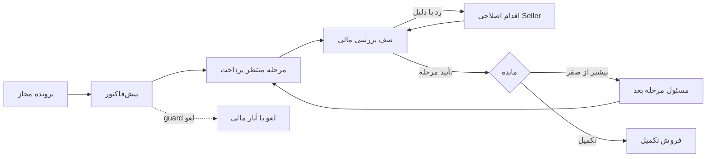

# Cross-role Architecture — ضمیمه گزارش اصلی

## Cross-role Permission Matrix

این ماتریس قرارداد **فعلی مشاهده/کد** است، نه permission پیشنهادی. `O`=خود/owned، `T`=تیم مجاز، `G`=قلمرو سازمانی ماژول، `C`=شرط cap/flag/state، `—`=در مسیر بررسی‌شده برای نقش وجود ندارد، `?`=اثبات نشده. UI visibility به‌تنهایی مجوز endpoint نیست. در جدول‌های این ضمیمه CODE کوتاه‌شده CODE VERIFIED و LIVE کوتاه‌شده LIVE VERIFIED است. در جدول‌های این ضمیمه CODE کوتاه‌شده CODE VERIFIED و LIVE کوتاه‌شده LIVE VERIFIED است. writeها فقط CODE VERIFIED و اجرای runtime آن‌ها NOT VERIFIED؛ HR/Finance همه موارد **NOT LIVE VERIFIED**. خواندن صفحه‌های شش نقش نخست مطابق inventory زنده است.

| قابلیت | Seller | Supervisor | Senior | Manager | Deputy | MIS | HR | Finance | شرط مهم |
|---|---|---|---|---|---|---|---|---|---|
| صفحه اصلی نقش | O | T | T | T+C | T | G | G+C | G+C | Manager reportcap shell را باز می‌کند؛ Finance tabs شرطی |
| پرونده/لید مشاهده | O+C | T+C | T+C | T+C | T+C | G+C | ? | linked context | V4/legacy، scope mode و ownerchecks مسیرها متفاوت‌اند |
| نتیجه تماس Seller | O | C/? | C/? | C/? | ? | — | — | — | handler owner/Admin؛ read تیم blanket write نیست |
| صدور فاکتور دستی | C | C | C | C | C | — | — | — | effective override + global feature + source/controlled-flow |
| فاکتور از پرونده | O+C | T+C | T+C | T+C | C | — | — | — | core actor/scope/owner + eligibility |
| فاکتور داخلی مشاهده | O | T | T | T/C | T | C گزارش | — | G+C | hierarchy scope و legacy Manager fallback متفاوت |
| ثبت اطلاعات واریز داخلی | O+C | T+C | T+C | T+C در کد | — | — | — | G+C | Manager UI نمونه کنترل نداشت؛ guard کد اجازه مسیر scoped می‌دهد؛ Financeview هم می‌پذیرد |
| پیش‌پرداخت ویرایش | O+C | T+C | T+C | C/? | — | — | — | C | stage/paid/review lock؛ grant کلی اعلام نمی‌شود |
| resend/copy link | O+C | T+C | T+C | T+C | — در UI | — | — | C | ارسال انجام نشد؛ copy≠send |
| تأیید پرداخت/گروهی | — | — | — | — | — | — | — | C | sn_approve_payment + current stage guard |
| رد/لغو مالی | — | — | — | — | — | — | — | C | sn_reject_payment، reason، refund/state guard |
| تحویل V4 از موجودی | — | O→Seller | O→Sup/Seller | O→Senior/Sup/Seller | O→4levels | G→saleslevels | — | — | active/scope/custody، skip-level explicit |
| برگشت V4 | — | C | C | C | C | C | — | — | actor transferhistory/RETURN؛ F01 حفاظت ناقص |
| unassign legacy | — | T+C | ? | C | ? | C | — | — | namespace جدا از V4return |
| MIS import/delete/purge | — | — | — | — | — | G+C | — | — | advanced MIS/Admin؛ consumed locks ضروری |
| ready conversion assignment | — | T+C | readonly در صفحه | C/? | ? | — | — | — | direct Supervisor؛ higher role blanket inheritance ندارد |
| own conversion | O+C | O+C | O+C | C/? | ? | — | — | — | assigned case و Dot guards |
| شماره اضافه request/review | O+C request | C | C | T+C review | C/? | — | — | — | override و reviewer role؛ approve runtime انجام نشد |
| HR request create | — | T | T | T | T کد | — | G | — | position-based، scoped subject |
| HR request review | — | C reviewer | C reviewer | C reviewer | C reviewer | — | G | — | currentreviewer درpending_review؛ HR همچنین pending_hr |
| HR finalapply/profile CRUD | — | — | — | — | — | — | G | — | HR guard/Admin؛ transferparent یا inactive/terminated |
| role/cap از position | — | — | — | — | — | — | G+C | — | side effect profileupdate؛ dedicated writecap فعلی ندارد |
| compensation/history | — | — | — | — | — | — | G | input read | date/rule/employment snapshots |
| HR import/export | — | — | — | — | — | — | G+C | — | nonce/apply، selected/all، field policy |
| impersonation/credentials | — | — | — | — | — | — | G+C | — | target داخلی/active/نهAdmin؛ readonly intrinsic نیست |
| executive reports/export | C | T+C | T+C | T+C | T+C | C | C/? | C | export sn_report_export جدا؛ runtime همه datasets تأیید نشده |
| MISreport/XLSX | O+C | T+C | T+C | T+C | T+C | G+C | — | — | source guard Admin/MIS/5salespositions؛ live فقط MIS |
| own wallet | O | O | O | O | O | — در nav | — | G+C | readpath legacy sideeffect F07 |
| Finance wallet/commission tabs | — | — | — | — | — | — | — | C | sn_view_wallet_commission؛ finance position لزوماً کافی نیست |
| commission rule/review/post/flag | — | — | — | — | — | — | — | C | **فعلاً sn_view_finance**؛ نام view دارای write است |
| legacy manual adjustment | — | — | — | — | — | — | — | Admin-only | manage_options+nonce؛ Finance generic نیست |
| commission recalculation | — | — | — | — | — | — | — | C | Admin یا sn_can_view_finance + nonce؛ write زیر مجوز view |
| gateway export | — | — | — | — | — | — | — | C | finance guard+nonce؛ external/local completeness |

چهار لایه policy لازم است: route، module، action و row/field. internal invoiceinfo در source Seller owner، management hierarchy، legacySupervisor meta و legacyManager fallback دارد. Scope mode خاموش بودن معادل نبود همه ownerchecks نیست. تست منفی cross-scope انجام نشده؛ «نشت رخ‌داده» ادعا نمی‌شود.

Permission target پیشنهادی (INFERENCE/HIGH): view finance، review/reject payment، manage rules، review run، post wallet، manage rollout مستقل؛ HR read/editworkforce/changeaccess/read-editcompensation/import/export_sensitive/impersonation مستقل. این‌ها **مفهوم capability پیشنهادی** هستند، نه نام cap موجود. Maker/checker با سیاست کسب‌وکار تعیین شود. Nonce جای authorization نیست؛ [WordPress capabilities](https://developer.wordpress.org/plugins/security/checking-user-capabilities/) و [Nonces](https://developer.wordpress.org/apis/security/nonces/) مستندات رسمی این تفکیک‌اند.

## Cross-role Feature Matrix

Work=کار مستقیم؛ Manage=مدیریت تیم؛ Read=نظارت؛ Owner=مرجع ماژول؛ Conditional=وابسته به assignment/capability. Evidence موجودی شش نقش BOTH/LIVE، HR/Finance CODE؛ تعلق معنایی پیشنهادی INFERENCE/HIGH.

| ماژول | Seller | Supervisor | Senior | Manager | Deputy | MIS | HR | Finance |
|---|---|---|---|---|---|---|---|---|
| contact/case workbench | Work | Manage | Read | Manage | Read | provenance | — | linked context |
| distribution/custody | receive | Manage | Manage | Manage | Manage | Owner | structure input | — |
| legacy leads | Work | Manage | Read | Read | aggregate | materialize | — | linked context |
| invoice/payment stages | Work | assist | assist/read | read/conditional assist | Read | hardlink report | — | Owner review |
| ready conversion | own assigned | Manage/own | Read/own conditional | conditional | conditional | source | — | reviewpayment |
| repeat/nextpayment | Work | Manage | Read | Read | Read | custody dependency | — | createoutcome |
| customer timeline | context | team | shared | team | report | lineage | — | financial |
| extranumber | request | conditional | conditional | review | conditional | sourcereconcile | override | — |
| HR requests | — | requester/reviewer | requester/reviewer | requester/reviewer | codereviewer | — | Owner/finalapply | — |
| workforce/hierarchy | own identity | read team | read team | read team | read team | recipients | Owner | compensationinput |
| executive report | conditional own | team | teams | teams | territory | conditional | conditional | conditional |
| MISreport | own scoped | scoped | scoped | scoped | scoped | Owner | — | — |
| wallet | own | own | own | own | own | — | input | ledger/readiness |
| commissionengine | result | result | result | result | result | — | effectiveinputs | Owner rules/run/post |
| gatewayreconcile | status | status | report | report | report | hardlinkoutcome | — | Owner |
| diagnostics/danger tools | — | local | local | local | summary | Ownerconditional | Ownerconditional | Ownerconditional |

## Cross-role Reports / Report Audit

Definitions فعلی `SN_Report_Executive` ده گزارش دارد؛ comment «هفت پرسش» قدیمی است. Shell در چهار سطح مدیریت Live؛ اجرای invoices_register در Supervisor با یک فاکتور Live. queryهای دیگر CODE VERIFIED؛ exports و historicalruntime NOT VERIFIED.

| گزارش / grain | سؤال و date basis | کلاس | تصمیم/دلیل | Evidence/Confidence |
|---|---|---|---|---|
| invoices_register / invoice | فاکتور صادرشده، created_at | ESSENTIAL | KEEP؛ reconciliation count | BOTH/HIGH نمونه |
| customer_profiles / scoped phone group | فاکتورهای مشتری، latest event | SUPPORTING | KEEP؛ phone group هویت قطعی شخص نیست | CODE/HIGH |
| customer_invoice_details / invoice | فاکتور مشتری منتخب | ESSENTIAL | MERGE drilldown profile؛ standalone nav ضروری نیست | CODE/HIGH |
| mis_assignments / transferevent | actor→recipient، event_at | ESSENTIAL | KEEP؛ eventcount≠casecount | CODE/HIGH |
| pre_invoices / issuedinvoice | صدور مستقل از پرداخت | ESSENTIAL | RENAME/تعریف؛ issued با opencurrent فرق دارد | CODE/HIGH |
| sales / completedinvoice | paid/approved و پرداخت کامل، completiontime | ESSENTIAL | KEEP؛ partial excluded | CODE/HIGH |
| online_sales / invoice+stages | stage amountهای آنلاین موفق بازه | ESSENTIAL | KEEP؛ کلinvoice نیست | CODE/HIGH |
| card_sales / invoice+stages | stageهای کارت تأییدشده دربازه | ESSENTIAL | KEEP؛ receipt upload موفقیت فروش نیست | CODE/HIGH |
| finance_pending / queue/event/asof | currentqueue یا entryevents یاhistoricalstate | ESSENTIAL | KEEP؛ mode/history coverage لازم | CODE/HIGH |
| finance_rejected / queue/event/asof | currentreject یا rejectevent یاhistoricalstate | ESSENTIAL | KEEP؛ یکinvoice چندreject می‌تواند داشته باشد | CODE/HIGH |
| raw leads | legacy imported_at | SUPPORTING | RENAME legacy، نه V4total | CODE/HIGH |
| raw paid/approved timestamps | invoice دارای timestamp | CONFUSING | NEEDS VALIDATION؛ completed sales نیست؛ legacyaudit حفظ | CODE/HIGH |
| raw payments/activity | paymentrow/event | SUPPORTING | MOVE advancedreconciliation، trace حفظ | CODE/HIGH |
| MIS endtoend | unique case/invoice، latestgatheredstate | ESSENTIAL | KEEP؛ semanticdefinitions مشترک | BOTH/HIGH |
| MISpreview | batch/source/category quality | SUPPORTING | MERGE Reports entry؛ quality data باقی | BOTH/HIGH |
| HR readiness/import/hierarchy/history | profile/run/change | ESSENTIAL | KEEP specialized؛ sensitivepolicy | CODE/HIGH، NOT LIVE VERIFIED |
| Finance queues/gateway/ledger/runs | invoice/stage/tx/run/item | ESSENTIAL | KEEP specialized؛ provenance/parity | CODE/HIGH، NOT LIVE VERIFIED |

Metric contract پیشنهادی: ID، label، grain، predicate، numerator/denominator، date basis/timezone، current/historical/originalowner attribution، scope/source coverage/freshness و drilldown query. کارت/table/export باید همان contract را بخوانند. invoice amount، received stage amount، confirmed revenue و wallet commission چهار مقدار متفاوت‌اند. loaded row count با total count فرق دارد. empty/loading/error/stale چهار state جدا باشند.

## Shared CRM Modules / Role-specific Modules

| Shared domain | مسئولیت مشترک | view اختصاصی | تصمیم |
|---|---|---|---|
| Identity/Access Context | user/position/rolecaps/actor/impersonation | ownaccount، HRaccesseditor | KEEP؛ modulevisibility ازpolicy |
| Customer/Case Core | stableidentity، source_ref، contactevents | Sellerworkbench، Managertimeline، MISlineage | MERGE core؛ phone prooffinanciallink نیست |
| Custody/Assignment | current owner/history/original seller/next actor | MISdelivery، multileveldistribution، readyassignment | KEEP envelope مشترک؛ rules هرworkflow جدا |
| Invoice/Stages | invoice/stage/payment/review | Selleraction، teamassist، Financedecision | KEEP oneaggregate وstage guard |
| Task Inbox | responsibility/nextaction/due/reason | Seller today، teamexception، HRreviewer، Financequeue | ADD commoncontract |
| Reporting Semantics | catalog/scope/time/grain/export | performance، MISquality، HRreadiness، finance | MERGE semantics؛ provenance حفظ |
| Audit History | actor/object/beforeafter/reason/correlation | custompayload bydomain | KEEP envelope مشترک؛ payloadاختصاصی |
| Wallet Ledger | postedtransaction/balance | ownincome، Financeaudit | KEEP pure read، posting service مستقل |
| Temporal Hierarchy | current/effective/history | salesscope، HRstructure، historicalreport | KEEP current وhistoricalcredit جدا |

| ماژول اختصاصی | owner | دلیل باقی‌ماندن اختصاصی |
|---|---|---|
| Dailyworkbench | Seller | صف تماس، own actions، repeat/stages |
| Directteamoperations | Supervisor | ظرفیت تیم مستقیم، readyassignment، assistdelegation |
| Multiteamexplorer | Senior | چندSupervisor، aggregateexceptions، readyreadonly |
| Operations/approvalconsole | Manager | extra-number review، archive، operational exceptions |
| Leadershipview | Deputy | role-leveldrilldown، territorymetrics، targetconditional |
| Dataoperations/quality | MIS | import/provenance/pool/plans/reconciliation |
| Workforceoperations | HR | hire/access/hierarchy/compensation/termination |
| Review/reconcile/ledger | Finance | evidence/stage/refund/runs/posting |

همه target decisions INFERENCE/HIGH. Shared component از Sellerfrozen foundation استفاده می‌کند؛ مشترک‌شدن component مجوزها را مشترک نمی‌کند.

## Status Architecture

Namespaces مهم source بررسی‌شده زیر؛ CODE VERIFIED، HR/Finance runtime NOT LIVE VERIFIED. Raw literal index ضمیمه است؛ enumهای ماژول‌های خارج هشت نقش قرارداد کامل انتقال فرض نشده‌اند. هیچ status/migration تغییر نکرده است.

| object/namespace | currentstates نمونه / actor | ambiguity وtarget decision |
|---|---|---|
| MIS validity | valid/invalid/duplicate؛ importer | duplicatephone≠duplicateperson؛ ازcontactstatus جدا |
| MIS assignment | unassigned/assigned_to_manager/assignmentfields؛ MIS | directdelivery می‌تواند باassignedmanager فرق کند؛ canonicalcustody |
| Distribution custody | distributed_forward/delivered_to_seller/returned_to_manager/returned_to_owner/returned_to_mis؛ eligibleholder | delivered≠unused؛ hardinvoicelink guard F01 |
| consumed distribution | converted_to_lead/lead_created/converted_to_dot_case +live_lead_id؛ service | consumerenum کافی نیست؛ invoicehardlink هم مصرف |
| Sellercontactflow | empty/no_answer/callback/duplicate/not_purchased/pre_invoice؛ owner/issuance | preinvoice eventتجاری؛ preserve adapter |
| Sellerarchive overlay | archived_at/reason/error؛ cron/reconcile | hide≠delete، contact وinvoice stateجدا |
| Legacylead | status + lead_status فارسی/قدیمی؛ legacypaths | علاقه‌مند/در بررسی/کنسل/خریدکرده labels؛ silentnormalize ممنوع |
| Invoicecommercial | pre_invoice/partial_paid/paid/approved/rejected/cancelled/payment_archived/recontact_requested | pending/draft/unpaid aliases نباید pre_invoice را ازmetric حذف کنند |
| invoice_status/payment_status | compatibilitymirror، receipt_uploaded/pending_financial_approval؛ finance/reconcile | effective resolver/discrepancy flag؛ سهfield همیشه consistent فرض نشود |
| Paymentworkflow | awaiting_payment/awaiting_financial_approval/awaiting_assignment/completed/archived؛ finalizer | completed=validstage+remainingtolerance، approvedtimestamp کافی نیست |
| Paymentstage | pending/receipt_uploaded/pending_financial_approval/approved/paid/rejected/cancelled | stageapproved≠invoicecomplete |
| Paymenttransaction | pending/verified/approved/rejected/paid، Dot superseded | gatewayverified≠financeapproved |
| Financialreturn | returned_to_seller/resent_after_return/cancelled_by_finance/cancelled_by_finance_refund | refundsuffix مدارک بانک نیست؛ reason+task |
| Repeat/recontact | recontact_requested/payment_submitted_after_recontact/cancelled_by_finance؛ closepayment_completed event | original seller≠next actor |
| Dotcase | awaiting_access_sms/ready_for_conversion/payment_link_sent وpendingfinance/partial/completion paths | case/contact/payment namespaces جدا؛ enum کامل خارجscope ادعا نمی‌شود |
| Convertercontact | new/follow_up/customer_declined؛ assignee | callback اینجا باSellerflow یکی نیست |
| HRemployment | active/inactive/suspended/resigned/terminated/probation؛ HR | profile/useractive وretainedrole؛ login denial نیازLiveQA |
| HRrequest | pending_review→pending_hr→approved/rejected/failed؛ reviewer/HR | approvalpath/appliedat؛ failedapply موفقیت نیست |
| Compensationperiod | is_active/effectivefromto/locked_after_payroll؛ HR | ستونlock تضمینenforcement نیست؛ temporalintegrity |
| Commissionapproval | generated/approved/rejected+locked_at؛ financeguard | F06 dedicatedreviewcap وimmutableinputs |
| Commissionpostingitem | posted/error، skipped/existing report | run rejected≠posting error؛ concurrencyQA |
| Wallet | credit/debit+type/source/meta | previewready≠postedcredit≠settled |
| MISreportjob | building/ready/cancel/expiry/exportready | metadataworkflow، نهcommercialstate |

Target (INFERENCE/HIGH): state machine هر aggregate مستقل؛ نمای ترکیبی «پیش‌پرداخت تأیید؛ منتظر مسئول مرحله بعد» از invoice+stage+task. stable machineID، dictionary فارسی مرکزی، رنگ ازfrozen tokens. reasoncodes+freenote برای عدم خرید/رد/برگشت/آرشیو/لغو. approved/ready/completed/archived globalstatus مشترک همه اشیا نیستند.

این نمودار مسیر عمومی مشتق ازcode است؛ gateway/Dot/operations وlatepayment adapterاختصاصی دارند. cancel مسیرpaid→unpaid ساده نیست؛ refundeventجدا لازم است.

## Handoff Map / Architecture

| مسیر | payload/acceptance | invariant وfailureowner | Evidence / Decision |
|---|---|---|---|
| MIS→sales | source/batch/validity/actor/recipient/time؛ active / eligible | unique case/provenance | BOTH؛ KEEP |
| sales→child/skip-level | item/current owner/note؛ custody/scope check | historical from/to≠current owner | BOTH/CODE؛ KEEP explicitexceptions |
| downstream→previousowner/MIS | unuseditem/reason/RETURN | F01 invoicehardlink بایدblockکند؛ actualreset اجرا نشد | BOTH/CODE؛ P0 KEEP باguard |
| Seller→Finance | invoice/stage/receipt/ref؛ pendingevidence | due≤remaining، originals ثابت | CODE؛ KEEP؛ runtime NOT VERIFIED |
| Financereject→Seller | reason/actor/time/stage | corrective task، رد قبلی حفظ | CODE؛ KEEP |
| partialpayment→next actor | paid/remaining/task | commissionowner≠actionactor | CODE؛ KEEP |
| readyDot→converter | case/options/assignment؛ direct Supervisor | attribution وlinks ثابت | BOTH/CODE؛ KEEP |
| completed→Woo/operations/shipping | type/order/paymentproof | no duplicateddelivery؛ revocation آثار | CODE dependency؛ runtime خارجscopeNEEDS VALIDATION |
| SalesHRrequest→parentreviewer | subject/type/reason/destination | pendingreview/currentreviewer/scope | BOTH/CODE؛ KEEP |
| reviewer→HR | approvalpath/pendinghr | applysuccessapproved؛ failurefailed | CODE؛ NOT LIVE VERIFIED؛ KEEP |
| HRcompensation→commission | effectiveperiod/rule/employmentsnapshot | pastcredit immutable، calculationdate | CODE؛ KEEP/temporal QA |
| approvedrun→posting | lockedrun/items/flag/APPLY | uniqueness/retryaudit | CODE؛ KEEP/dedicatedcap |
| Finance→externalrefund | refundrequired/confirmedflag | linkedproof/date/amount/owner لازم | CODE flag؛ ADD tracking INFERENCE |
| legacy→V4 | sourcekind/id adapter | no lostidentity/history | CODE؛ KEEP until verifiedmigration |

Missing handoff contract پیشنهادی: sender/receiver/state/reason/due/acceptance/failureowner/correlationID در task/case. acknowledgement برای انتقال پرریسک پس از نیازسنجی، نه همه clickها. parentchange گذشته handoff را بهگیرنده جدید نسبت ندهد.

## Cross-role Duplication / Product Simplification Opportunities

| فرصت | decision | ساده‌سازی واقعی / قابلیت حفظ‌شده | priority/evidence |
|---|---|---|---|
| Deputy4leveltables + siblings | MERGE | performance explorer؛ role levels/scope/allmeasures حفظ | P2/BOTH ساختار،INFERENCEتصمیم |
| appendedreportcenters | MOVE/MERGE | Reports entry context-aware؛ executive/raw/exportcap حفظ | P2/BOTH |
| legacy/V4worklists | MERGE adapter | caseworkbench؛ sourceIDs/hardlinks/events حفظ | P1/BOTH |
| return/unassign/recall | SIMPLIFY entry | impactpreview؛ namespace-specificbackend/locks حفظ | P0/P1/CODE |
| customeractions | MOVE | sharedprofile context؛ timeline/financehistory حفظ | P2/BOTH |
| 4archiveviews | MERGE | reason/type/age explorer؛ 3/5day وrevivalrules حفظ | P2/BOTH |
| HRparallel editors | MERGE | mutationservice/editor؛ identities/effective dates/fieldscopes حفظ | P1/P2/CODE |
| Financereceipttab | MERGE facet | reviewqueue؛ approvedreceipt/history باقی | P2/CODE |
| walletlegacy/newposting | MERGE policy | singlepostingowner؛ legacyledger/reversal حفظ | P1/CODE |
| diagnosticslanding | MOVE | readinesssummary وexception؛ technicaltools حفظ | P2/BOTH/CODE |
| ManagerUserIDmetric | REMOVE | ازKPI؛ identityheader وactorlog حفظ | P2/BOTH |
| ownconversion بدونroleassignment | NEEDS VALIDATION | conditional module؛ personalworkواقعی حفظ | P2/BOTH |
| documents/training/bankimport | NEEDS VALIDATION | جلوگیری featurecreep؛ businessscope تعیین | P3/CODE+INFERENCE |

خالی‌بودن جدول دلیل حذف نیست. REMOVE فقط KPIUserID وeditorduplicate بعد برابریقابلیت؛ هیچ حذف داده/history پیشنهاد نشده است.

## Missing Capabilities

| ID | شکاف / پیشنهاد | owner | priority/confidence/evidence |
|---|---|---|---|
| M01 | canonical consumerlock/transactionrecheck برایF01 | Core/MIS | P0/HIGH/BOTH |
| M02 | semanticmetriccatalog/reconciledrilldown | Reporting | P1/HIGH/BOTH F02–04 |
| M03 | financewritecapهای مستقل | Access/Finance | P1/HIGH/CODE F06 |
| M04 | pure read + controlledposting | Finance | P1/HIGH/CODE F07 |
| M05 | termination impact/handoverwork | HR/Sales | P1/HIGH/CODE dependency؛INFERENCE solution |
| M06 | refundobject/proof/reconciliation | Finance | P1/P2/HIGH/CODE flag؛INFERENCE solution |
| M07 | profile/access/credentialcap تفکیک | HR/Access | P1/HIGH/CODE |
| M08 | empty/loading/error/stale/freshness | Shared | P2/HIGH/LIVE |
| M09 | common nextactioninbox/schema | Sales/HR/Finance | P2/MEDIUM/INFERENCE |
| M10 | contact/SMS policyدامنه تعیین شود؛ نقص قانونی ادعا نمی‌شود | Productowner | P3/LOW/NEEDS VALIDATION |
| M11 | document/trainingworkflow دامنه روشن شود؛ columns محصولکامل نیستند | HRowner | P3/MEDIUM/NEEDS VALIDATION |
| M12 | non-Admin HR/Financeaccounts +negativeQA | QA/Admin | P1 runtimeverification/HIGH؛ blockerAuditنیست |

## Recommended Target Architecture

پیشنهاد INFERENCE/HIGH برای تصویب WHAT/WHY؛ پیاده‌سازی/redesign ساخته نشده است.

| layer | aggregates/services | roles | مسئولیت |
|---|---|---|---|
| CRM Core | identity/access،customer/case/source،events/tasks | all | stableIDs،row/fieldpolicy،vocabulary/history |
| Sales Operations | contact،custody/distribution،invoiceorchestration،ready/repeat | Seller/Supervisor+assist | daily actions،owner/next actor،delegation |
| Sales Management | team explorer/capacity/exceptions،requests | Senior/Manager/Deputy | hierarchyperformance/decision؛ financeapproval مستقل |
| MIS Reporting/Data Operations | quality/import/provenance/plans/reconcile/report | MIS+scopedreaders | unique facts/custodylineage/export parity |
| HR | workforce/access/hierarchytemporal/request/compensation | realHR | identity/position/effective dates/termination |
| Finance | evidence/reconcile/refund/rules/run/post/ledger | cap-specific Finance | stageintegrity/approvedsnapshot/posting |

Target navigation WHAT:

- Seller: کار امروز/پرونده، فاکتور/اقدام بعدی، تبدیل شخصی شرطی، پروفایل مشتری contextual، درخواست شرطی، حساب/درآمد من؛ HOW ازSellerfrozen.
- Supervisor: کار تیم، فروشندگان، تحویل/ظرفیت، readyconversion، فروش/فاکتور، درخواست، گزارش، حساب من؛ diagnosticsadvanced.
- Senior: چندتیم، ساختار/performance explorer، تحویل، readyreadonly، فاکتور، HRrequest، Reports؛ personalconversionconditional.
- Manager: operations/exceptions، تحویل/performance، فاکتور، شماره‌اضافه/HRreview، archive،Reports،حسابمن.
- Deputy: leadershipoverview،hierarchy/performance،exceptions،Reports،direct allocation conditional،حسابمن.
- MIS: کار امروز، ورود/کیفیت، پرونده منبع، تحویل/custody،Reports/reconcile،planning/maintenanceadvanced.
- HR: نیرو،onboarding/transfer،requests،ساختار/access،compensation،exceptions/audit؛credentials/impersonationpolicy مستقل.
- Finance: reviewqueue،reconcile/refund،ledger،rules/runs/posting،Reports؛rollout/adminmaintenance جدا.

Invariants target:

1. SourceRef ثابت؛ phone فقطdiscovery ونهfinanciallinkproof.
2. یکcurrentcustody؛ historicalfrom/to/actor باoriginalowner/credit/next actor مستقل.
3. activeinvoicehardlink مانعreset پرونده مصرف‌شده؛ rejected/cancelledاستثنا تنهاباpolicyمصوب.
4. paid+remaining=total باtolerance؛stageapproval≠invoicecompletion.
5. approvedrun snapshot قفل؛posting unique business key/transaction/retryaudit.
6. HRperiod معتبر؛ تغییرtoday گذشتهcredit را ننویسد؛termination workowner بلاتکلیف نکند.
7. card/table/export یکquery contract/scope؛eventcohort≠historicalasof.
8. read renderer businessmutation نکند؛migration/maintenance مستقل.

## Priority Roadmap

P0=تمامیت custody/financialsource؛P1=مجوز/تصمیم/گردش‌کار اصلی؛P2=ساختار/کارایی؛P3=گسترش/بهینه‌سازی. effort/time بدون engineeringestimate تعهد نمی‌شود. **آینده پیشنهادی، هیچ Implementation شروع نشده است.**

| ترتیب | Live Audit فعلی | Product Decisions | UX بعدی | Implementation بعدی | QA gate | Freeze |
|---|---|---|---|---|---|---|
| Gate0 cross-role | F01 read/code؛mutationnotrun | P0 مصرفcanonical | eligibility/impact | return/recall/deleteguards | invoicedV4cannotreset،legacy/Dot/race/rollback | invariantfreeze |
| 1 Seller | inventory؛writeuntested | source/stage/owner/override | frozenbinding | adapter/API | own/crossowner،callback/archive،physical/partial/reject/latepay | bindingfreeze |
| 2 Supervisor | inventory/reportsample | directteam/assist/ready/F04 | teamconsole | scope/metrics/return | direct/indirectdeny،consumedreturn،parity | structurefreeze |
| 3 Senior | inventory/readonly/KPI | F02/F03،personalconditional | multiteamexplorer | sharedfacts | scope/readonly/KPIdrilldown | structurefreeze |
| 4 Manager | inventory/F05 | reconcile/binder/routepolicy | exceptions/approval | query/binder/policy | error/stale/blank、requests、no unintendedgrant | structurefreeze |
| 5 Deputy | hierarchy/tables | metrics/4viewmerge | leadership | sharedfacts/boundedload | ancestor doublecount/read-only | structurefreeze |
| 6 MIS | unique/lineage/report | F01/health/semantics | dataops/Reports | links/eligibility/health | importisolation،lock、snapshot/export/scope revoke | invariantfreeze |
| 7 HR | codecomplete؛livepending | access/temporal/termination | editor/requestimpact | domainupdate/history | non-Admin/denyothers،identity/overlap/insert failure/handover | afterQAfreeze |
| 8 Finance | codecomplete؛livepending | F06/F07/stage/refund | queue/ledger/runs | capsplit/pure read/post | viewerdeniedwrite、partial/cancel/refund/concurrentpost/privacy | afterQAfreeze |
| 9 cross-rolecleanup | matrices/status/handoffdone | shareddefinitions | Claude sharedcomponents | contracts/legacyadapters | E2Ehandoff、dictionary/parity、scopeoff/enforced | architecturefreeze |

P0 acceptance: فعالfinanciallink درUIوbackendreturnblock، transactionrecheck،historyمحفوظ. P1: card/drilldownsamecohort،viewerreadonly،failure rollback/explicitpartial،originalowner ثابت. P2: هرfeatureinventory باpolicy یکسانقابلدسترسی،freshness/labels/exporttraceable. P3: targets/savedviews/docs/training/bankimport فقطپسbusiness validation وdesignownershipClaude.

## Completion / Runtime Remaining

بررسی هشت نقش و تمام موضوعات درخواست‌شده در گزارش اصلی و این ضمیمه تکمیل شده است. اعتبارسنجی اجرایی باقیمانده شامل حساب واقعی HR/Finance، تست منفی مجوزها، عملیات تغییردهنده و همزمانی/شکست، Import/Export بزرگ و تحویل کار به نقش‌های خارج دامنه است. این موارد QA آینده‌اند؛ موفقیت اجرایی از کد استنتاج نشده و نبود حساب‌ها مانع Audit نبوده است. حساب Admin بعد از impersonation به admin1 برگشته است. هیچ تغییر عمدی محصول، نقش، داده یا پیاده‌سازی توصیه انجام نشد.

CRM PRODUCT & ROLE ARCHITECTURE AUDIT COMPLETE — NO CODE CHANGED
